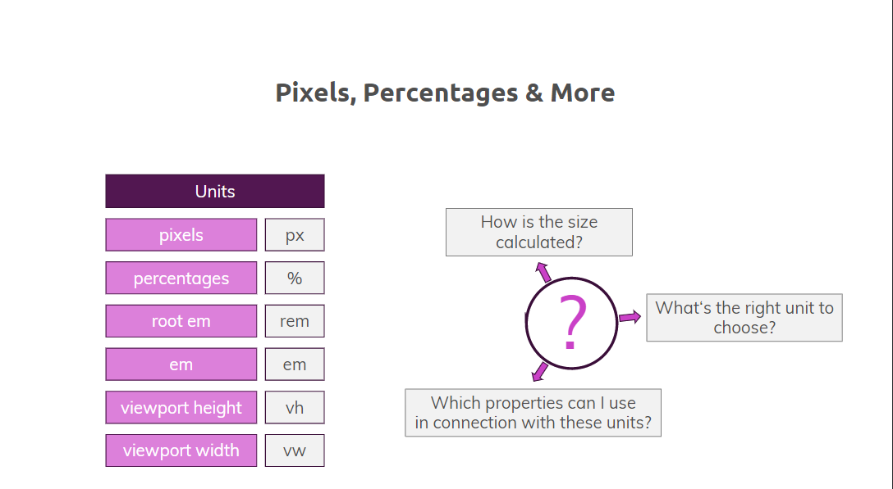
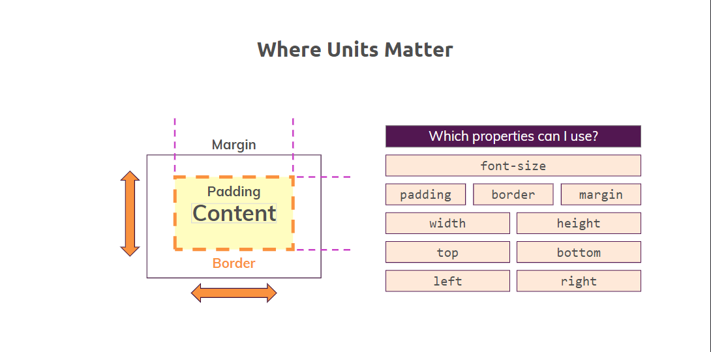
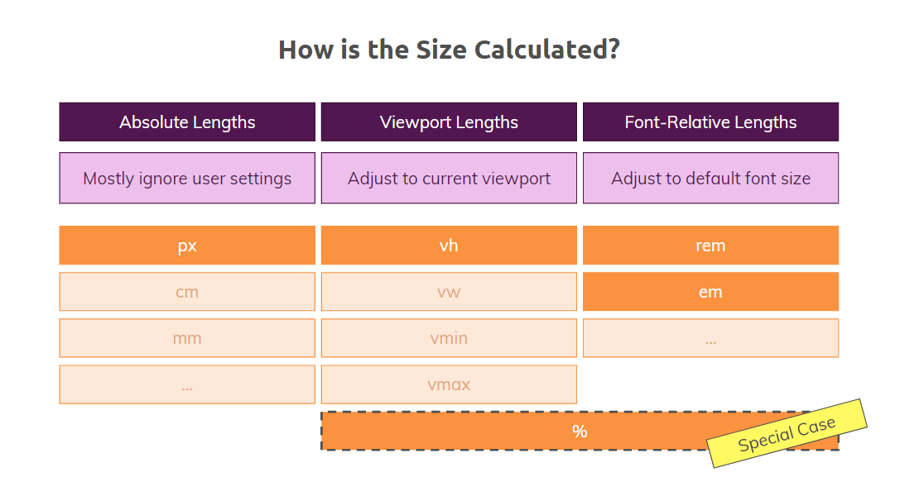
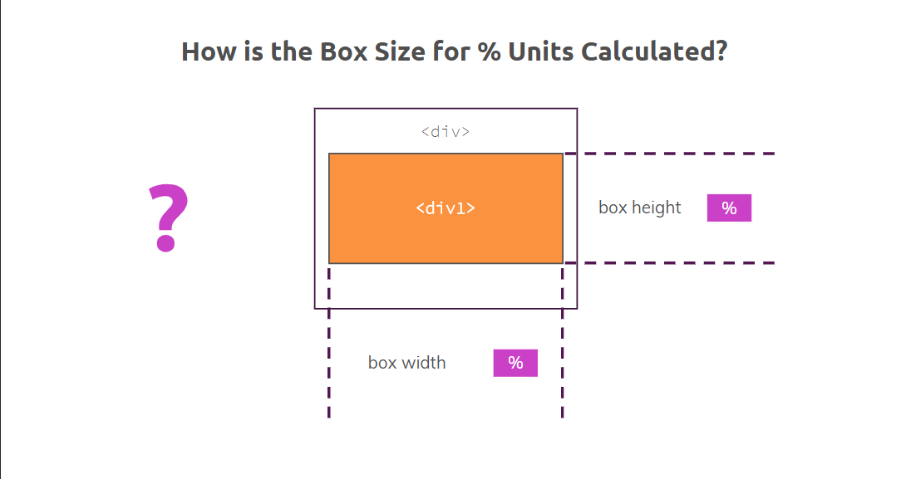
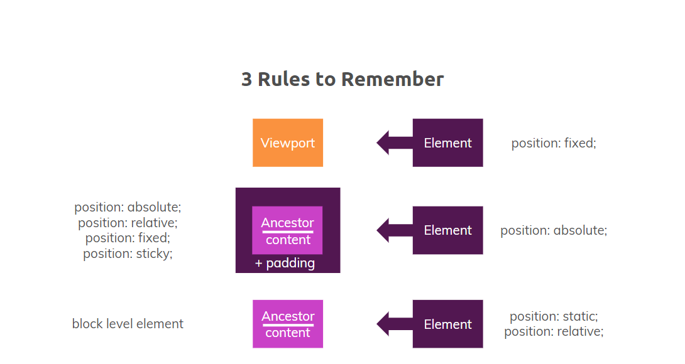
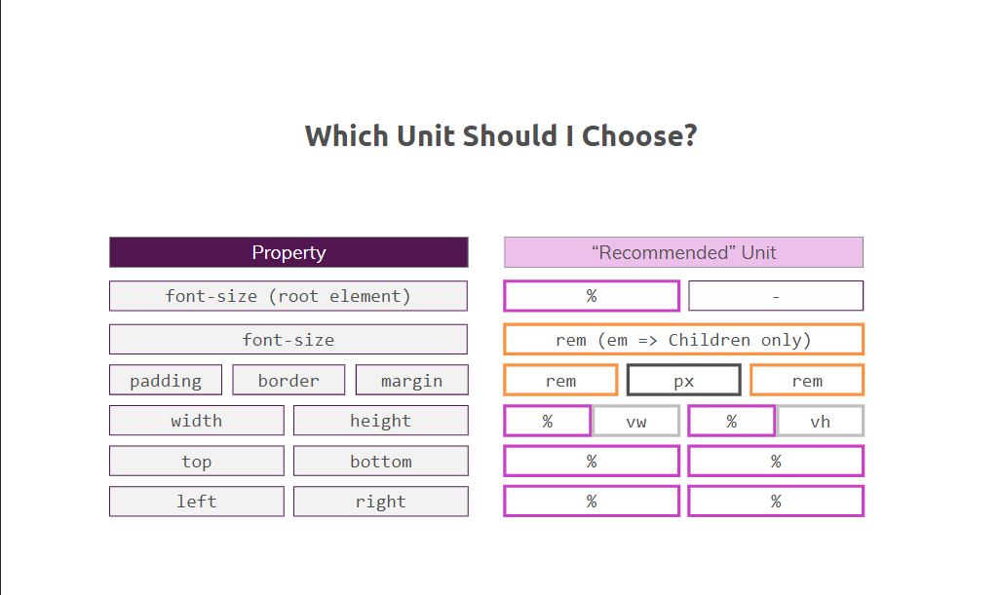
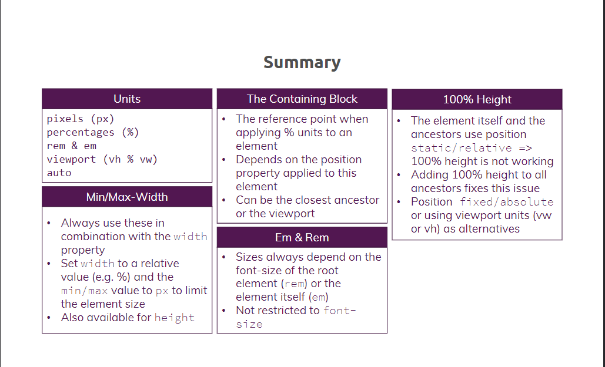

# Getting Started

<p style="text-align: center; font-size: 20px; font-weight: bold; color: #e68a00"> Module Introduction</p>

---

- Content:
  - Theory - Which units can be use?
  - "%" and the containing block
  - "min-width" & "max-width"
  - Understanding "rem" vs "em"
  - Working with "vw" and "vh"

<p style="text-align: center; font-size: 20px; font-weight: bold; color: #e68a00"> What's wrong with our project units? </p>

---

- if you look at the font size, for example right here, you help me set her up, you can see this size doesn't change if
  I increase the width of window. Now you could say this is clear because if somebody cannot read the text, he can
  increase the size and I would totally agree but I will also say that with this behavior, we totally give the browser
  the chance to decide how our size should be zoomed and how the different elements on our side should be zoomed.

- Now if we change the browser font size to large then we can some font of our app got increased because there is not
  font-size we have used. But other place where we use font-size stays same because we used fixed pixels there. We can
  remove the font-size in css but problem is all the font size on our app would look same, which we definately would not
  want.
- So using a fixed font size of pixels and letting the browser zoom do the work is not the best idea.

<p style="text-align: center; font-size: 20px; font-weight: bold; color: #e68a00"> Pixels, Percentages & More </p>

---



- we worked with the pixels, with the unit of px and we work with percentages, so with the percentage sign basically. Now
  in addition to that, we got more units available in CSS, for example we have the `root em` and the root em is written
  with a unit of `rem`. Root em or rem is a unit that refers to the font size. In addition to that, we also have the
  viewport height, written as vh and we have the viewport width, written as vw.

- The problem now is, well you probably have this question mark in your head now because we basically understood pixel so
  far but we are not even sure about the percentages and what they actually refer to and then I come over with new units
  and with rem and em and so on, so this is maybe a bit too much.

- But actually, we can break down these units and the issues arising in connection with that to three core questions -

  - the first question probably is this one, which properties can I use in connection with these units?

  - The second question is how is the size calculated?

  - the last question probably is, what's the right unit to choose right now?

- Question-1: which properties can I use or where units matter?

- 

- Basically we have our box model, In your box model, you have the content right here and if we think about this content
  and we have the background color, for the background color we don't need units but the font size,I think this is
  probably a property where a unit, for example pixels as we did it so far, definitely makes sense but maybe there is
  more than pixels that we can use for the font size.

  If we then come back to our box model and think about the next step, this normally is the padding and if we think about
  the padding which specifies the distance between the content and the border, well then the padding itself would be a
  really good property to apply a specific unit that defines the size of this padding.

  The same thing is true for the border actually, the border is also a property where applying a specific unit definitely
  makes sense and if we follow our box model, then this is of course also true for our margin right here.

- Now with that, we see that we have already four properties where units definitely matter. Now let's continue, what else
  do we have in our box model? Well we have this right here, the width and we have this right here, height because height
  and width are also properties where we have to specify a unit, this can be a pixel or a percentage as we saw it so far
  but maybe there are more units we can apply also and maybe there is also a unit which makes more or less sense, this is
  also something we have to find out.

- However, with height and width, there are only well basically four more properties where units actually matter. This
  one right here, the top and bottom properties, so properties that can be used after we be applied the position
  property, we now understood two things, that we have different units that we can use and that we have different
  properties where applying the units make sense. The connection between the properties and the units is not perfect yet.

<p style="text-align: center; font-size: 20px; font-weight: bold; color: #e68a00"> An overview of available sizes & 
units </p>

---

- Question-2: How is the size calculated?

- 

- Let's have a look at that for the different units we have. The first category would be `absolute lengths`. What happens
  right here is that these absolute lengths mostly ignore user settings. Well what do I mean by that? Well if we apply
  pixels for example, we saw that in the example on our website on the customer page with the font size of 20 pixels.

  If I do that and our user changes the default font size, well then the font size on the website won't change because
  the user settings as it's written right here are ignored. So we specify a pixel and that's it, the user cannot change
  it.

  In addition to this pixel as an absolute length, we also have centimeters, millimeters and more but these are not units
  you should use in web development because centimeters and millimeters, these are units you use if you have something on
  paper because on paper, one centimeter is one centimeter, on a display, one centimeter definitely is not equal to one
  centimeter, so using these units in the end will just lead to a total mess. So we should avoid these, we won't use
  these, therefore I just wanted to show you that these units are also existing but we will stick to pixels when it
  comes to absolute lengths.

- Well the second category are `viewport lengths`. Viewport lengths, as the name says actually, adjust the size of the
  element we apply to according to the viewport, the viewport lengths can be applied with the vh value, so viewport
  height but also with viewport width. and we have more, we have vmin and vmax. these lengths allow us to adjust our
  size more dynamically to the viewport, basically the visible part of our website in the browser.

- Then we have a third one, font `relative lengths`. As the name says, font relative lengths adjust to the default font
  size, this is the unit that allows you to do that. rem, em

- And with that, there is only one category left and this category is a category we already know, the percentages, we
  applied these a lot already on our website. But the interesting thing is that, although we apply the percentages, we
  didn't understand how it works in detail and more importantly, it's even a special case.

- 

  Now why is the `percentage` value a special case? Well because we have to answer the question, how this box size is
  actually calculated if we use the percentage unit to calculate the box size because the situation normally is the
  following, you have a div, this can have a padding and a border, like here and this div is normally nested into another
  div.

  This could be the body element, this could be another parent element, anything like that. Well and now the question is
  of course, this box size right here as a percentage value and this box width right here, also as a percentage, well
  what is this height and this width referring to?

  So if I add a width of 80%, what is this 80%? Is it 80% of the parent, 80% of the body element, of the HTML element or
  of anything else we don't know so far? This is exactly the problem we have to take a closer look right now and for
  that, we have to understand the so-called "containing block".

<p style="text-align: center; font-size: 20px; font-weight: bold; color: #e68a00"> Rules to Remember: Fixed 
positioning & "%" </p>

---

- 

- Let's say we have an element and position: fixed is applied on that. the position property definitely has an impact on
  the way the percentage unit behaves. Now how does this impact work? Well the reference point for such an element with a
  percentage unit is called the containing block. if we applied a width of 10% to it, so 10% width of a child would be 10
  pixels if the containing block has a width of 100 pixels.

  Now the issue is that the containing block depends on the position property applied to our element right here and in
  case the position property or the value for this property that we applied is fixed, then the containing block is not
  an element, it's the viewport and that's actually quite nice because if you remember back the position module, then we
  also had that relationship between a fixed positioned element and the viewport.

- `Whenever we have an element which has the position: fixed declaration applied and a percentage unit, well the containing
block is the viewport. This was the first rule to remember.`

- Refer navbar which ha position: fixed and width: 100%,

  ```css
  .main-header {
    width: 100%;
    position: fixed;
    top: 0;
    left: 0;
    background: #2ddf5c;
    padding: 0.5rem 1rem;
    z-index: 1;
  }
  ```

<p style="text-align: center; font-size: 20px; font-weight: bold; color: #e68a00"> Rules to Remember: Absolute positioning & "%" </p>

---

- Now with the different position value, the containing block also changed. Previously, we had the viewport, now we have
  an ancestor. the important thing is that the percentage now, so the percentage unit of our element refers to this
  ancestor's content plus the padding, that's really important. So the percentage unit of our element with the position
  absolute declaration refers to the ancestor's content plus padding.

- The question now is, which element is now the containing block the containing block for an element with the position
  absolute declaration applied is the closest ancestor which is not position static.

  ```css
  #product-overview {
    background: linear-gradient(to top, rgba(80, 68, 18, 0.6) 10%, transparent),
      url("images/freedom.jpg") left 10% bottom 70% / cover no-repeat border-box,
      #ff1b68;
    width: 100vw;
    height: 40vh;
    padding: 0.8rem;
    margin-top: 2.6rem;
    position: relative;
  }
  ```

  ```css
  #product-overview h1 {
    color: white;
    font-family: "Anton", sans-serif;
    position: absolute;
    bottom: 5%;
    left: 3%;
  }
  ```

<p style="text-align: center; font-size: 20px; font-weight: bold; color: #e68a00"> Rules to Remember: Relative/Static 
positioning & "%" </p>

---

- We have positioned static or position relative applied right here. If that is the case, then the containing block again
  is an ancestor, like we had it before but this time, it's only the content of the ancestor, so not content and padding
  like we had it before when our element had the position absolute declaration applied but with position static or
  relative, it's only the content.

  Now how do we now identify the containing block, so which is the ancestor we refer to? Well the answer is there is
  simply the closest ancestor which is a block level element.

<p style="text-align: center; font-size: 20px; font-weight: bold; color: #e68a00"> Fixing the height: 100% Issue </p>

---

- The backdrop has the purpose to cover the entire website, so it should be on top of all the other elements we have
  because we will soon, in the next module to be more precise, add a pop-up window you could say which should be on top
  once you click a button. Below that pop-up, we want to have this backdrop, this slightly transparent backdrop and
  behind that backdrop, all the rest of the website should be located.

- Refer .backdrop class

  ```css
  .backdrop {
    display: none;
    position: fixed;
    top: 0;
    left: 0;
    z-index: 100;
    width: 100vw;
    height: 100vh;
    background: rgba(0, 0, 0, 0.5);
  }
  ```

<p style="text-align: center; font-size: 20px; font-weight: bold; color: #e68a00"> Defining the font size in the root element </p>

---

- There can be cases though where you say that you want to change the font size for the entire HTML element from the
  beginning, depending on the browser settings.

  You can do this as below-

  ```css
  html {
    font-size: 75%;
  }
  ```

<p style="text-align: center; font-size: 20px; font-weight: bold; color: #e68a00"> Using "min-width/height" & "max-width/height" </p>

---

- Currently we have image on customers page. this image or the size of this image is defined because the image is inside
  this image container, here we have the image, the image has a width of 100%. It's 100% of its containing block which is
  this testimonial image container class right here and this has a width of 65% of its containing block which is the
  testimonial class, so the entire page width right here as we can see it. Now wouldn't it be great if we could limit the
  size of the container because if the image has a width of 100% of our container, well if the container wouldn't get
  bigger and bigger and bigger, then the image will also stay smaller.

- With the width right here, we have this percentage value, this means the image increases and increases depending on the
  width of our device. But if we now add a fixed value as a maximum width, we could restrict that width to this maximum
  we defined and with that, our image wouldn't get bigger than we want it to be.

  For example, if we inspect our image, we can see it has like 573 pixels now which is already quite big but let's say we
  fix it to 580 pixels. So if we do that right here and reload the page, you can see that nothing's changed and if I
  decrease the size, it still gets smaller and smaller but if I increase the size now, can you see it? Right here as soon
  as we reach our limit that we defined, this 580 pixels, our image cannot get any bigger and that's of course a big
  improvement because imagine visiting our site on a really big device, a TV screen for example.

  I think it wouldn't be a good look if you would just see the entire screen filled with these two images, therefore this
  max width property is a really easy way to make sure that you restrict the maximum size of your images.

  What you could also do is, you could for example change the max width to a let's say min width right here and say that
  min-width shouldn't be smaller than for example let's see, well let's say this size right here, so this is 350 pixels
  let's say, so this is also possible of course.

- The important thing to keep in mind for you is that with the combination of a width property with a percentage value
  and a max width defined with a fixed value, pixels in our case, you can make sure that your website also is displayed
  in a nice way, on really big screens or with the min width value, you you can make sure that certain elements are not
  displayed smaller than intended by you.

  ```css
  .testimonial__image-container {
    width: 65%;
    max-width: 540px;
    min-width: 350px;
    display: inline-block;
    vertical-align: middle;
    box-shadow: 3px 3px 5px 3px rgba(0, 0, 0, 0.3);
  }
  .testimonial__image {
    width: 100%;
    vertical-align: top;
  }
  ```

<p style="text-align: center; font-size: 20px; font-weight: bold; color: #e68a00"> Working with "rem" & "em" </p>

---

- Now for the fonts, we have better options than pixels, so let's have a look at rem and em. em and rem are units which
  are calculated based on the font size. we already learned that if we go to our settings right here, that the user can
  change the font size, for example to very large, like that. If we go back to our page, we saw that the nav bar font
  size increases but the text right here stays the same.

  This is simply due to the fact that our testimonial class, this one right here, has a font size applied, a font size
  property by us of 20 pixels. This means, let me change it back again to the recommended one, the default value, the
  default font size that the nav bar gets smaller again but right here, our class doesn't change because we have this
  font size applied. That's the first issue we have actually because I said that already in one of the earlier lectures,
  if our user, our website visitor wants to increase the font size, well we should allow him to do this, therefore
  definitely something we have to improve.

- Now for that, we have different ways to approach this issue. The easiest one would be to simply change the font size
  right here, this 20 pixels, to this em we just saw because em apparently multiplies a value and by that, seems to be
  more dynamic. and now change the font size of 20 pixels to let's say 1.2em because we saw that 1em is apparently equal
  to 16 pixels, so 1.2 seems to be a nice approximation. Now with that, things got a bit more dynamic.

- The problem still is that we don't have the entire control of all our elements, the h1 element for example still has the
  font size applied by the browser. So let's also change that by going to the testimonial name class which we have right
  here and now apply such a font size of 2em right here. If we do that and reload the page, nothing changes but now we are
  the ones who define that 2em should be applied, so it's not depending on the browser anymore but we are the ones who
  specify this code.

- For the h2 class, we have this font size of 18 pixels and that's not what we want right because we want to make things
  dynamic, this means if we keep it the way it is right now and we increase the font size to large again in the browser,
  we can see that the founder of techanalysis.com text remains at 18 pixels, so not the best thing to do, so let's also
  change that to medium like that and work on the testimonial subtitle class, this is the class right here and let's change
  this font size to 1.1em maybe because we saw 1em if we have the default browser size of 16 pixels is close to 18 pixels.
  If we reload that, we see it's slightly bigger, let's see why. Now what's that issue?

- This is strange right because I actually said that it's 1.1em, so the normal size times 1.1 but now it's too big.
  Well that's basically the problem of em, as we can see right here em inherits the previous sizes and by that multiplies
  the em with the previous em. there is another approach which helps us to avoid exactly these issues and this is the `rem units`.

  Now the only calculation that is done right now is the code is told to do the following, just take the font size that
  is set by the browser settings, so 16 pixels in our case and multiply it with 1.1 because rem, the r in rem stands for
  root.

- And that's actually the cool thing about rem, you can easily specify the font size or also other sizes of course, it's
  not restricted to fonts only, the important thing to keep in mind though is that rem and em always refer to the font
  size, that's the basic size value that they take into account but you can also use rem for margins for example, we'll
  see how this works. But with that rem approach, you really got a powerful tool to make your fonts more flexible and
  make it easier for the user to display the website the way he prefers it to be displayed.

- en sizes are inherited from parent elemens, while rem sizes are inherited only from root element. So use rem whenever
  you can em, until unless you don't want to inherit from parent element.

  ```css
  .testimonial {
    /* font-size: 20px; */
    font-size: 1.2rem;
  }
  ```

<p style="text-align: center; font-size: 20px; font-weight: bold; color: #e68a00"> Adding "rem" to Additional properties  </p>

---

- Always keep in mind that the rem, no matter if you apply it as font size or a margin for example, always refers to the
  font size though, so the calculation basis for rem is the initial font size of the HTML element. Default font size of
  our browser is 16px.

- The box shadow is something that should not increase or decrease with the actual font size, so pixel should be fine.

- Applied rem to padding and margin as well. Refer customer.css, package.css

  ```css
  .testimonial:first-of-type {
    margin-top: 6rem;
  }
  ```

<p style="text-align: center; font-size: 20px; font-weight: bold; color: #e68a00"> Finishing "rem"  </p>

---

- For border, you can stick to pixel.

- Applied rem to main.css, shared.css

<p style="text-align: center; font-size: 20px; font-weight: bold; color: #e68a00"> Understanding the viewport units "vw" & "vh"  </p>

---

- These numbers basically mean, it's basically a percentage number. This just indicates that it always refers to the
  viewport and that's the important difference. for example if we change .backdrop width: 80vw; then backdrop covers 80%
  of the width of our viewport.
- It simply allows us to, always refer our sizes to the actual viewport no matter which position property we have right
  here.

- There are two more units for this viewport that we can use. One of these is vmin, Well, view min simply takes 80% of
  the smaller viewport and in our case if we make this bigger, we can see it doesn't increase the width because in our
  case, the smaller viewport is of course the height, so the height is smaller than our width right here.

  Now in addition to view min, we also have view max which as you can imagine simply works the other way around, so if I
  reload, we can see that the width increase because now we take 80% of the larger distance between the width and height
  of the viewport. Adjusting image height on main page using "vh"

- Refer shared.css -> #product-overview

  ```css
  .backdrop {
    display: none;
    position: fixed;
    top: 0;
    left: 0;
    z-index: 100;
    width: 100vw;
    height: 100vh;
    background: rgba(0, 0, 0, 0.5);
  }
  ```

<p style="text-align: center; font-size: 20px; font-weight: bold; color: #e68a00"> Windows, Viewport Units & Scrollbars </p>

---

- Hiding Scrollbars on Windows machines
  After adding vw, you probably saw that the scrollbars appeared in case you are working on Windows. This happens as
  using vw on Windows does not include the scrollbars - vw: 100 is equal to 100% of the viewport width + the scrollbars. On the Mac this is not an issue, but when using Windows it is as the scrollbars are displayed by default.

- In case you don't want to display these scrollbars, you can use one of these solutions:

  - Use width: 100% instead of vw: 100

  - Add overflow-x: hidden; to the body selector in the shared.css file to hide the horizontal scrollbar (or overflow-y:
    hidden to hide the vertical scrollbar)

  - Alternatively you could also use the ::-webkit-scrollbar pseudo element. Simply add the following code to the
    shared.css file:

  ```css
  body::-webkit-scrollbar {
    width: 0;
  }
  ```

- To make sure this works correctly on different browsers, you have to add additional code to it. This blog post nicely
  summarizes all the code needed right here. Make sure to follow these approaches in case you don't want to display the
  scrollbars on Windows machines.

<p style="text-align: center; font-size: 20px; font-weight: bold; color: #e68a00"> Choosing the right unit </p>

---

- 

- Which unit should I choose?

- font-size (root element):
  If we want to add a specific font size to our HTML element, one recommended unit is `percentage`. We had a look at
  that, applying 100% doesn't make a lot of sense but you can do that if you want to but you can apply 75% or some value
  below 100% in case you want to make sure that the default font size on your website is smaller than the browser
  setting.

  Another possible unit is of course this one, nothing and that's also the one we use in this course because I explain
  that we want to decide how the font sizes change depending on specific elements but in general, the font size can be
  in line with the browser setting.

- font-size:
  The second property we can use to apply some units to is the font size in general. Here we saw that `rem` is probably a
  nice idea to follow, it's easy to use, it's easy to see also for other developers and if you didn't apply any kind of
  specific font size to the root element, it's always clear that the font size with rem refers to this root element.

  You can also use em, we saw that but I would recommend only using it for children, so not some em chain, so applying em
  to the parent to the child and to other child because you saw it in the example, it can get messy quickly

- padding & margin:
  We saw that in our example on the website, we used rem for both. Of course if you want to have a different behavior and
  you say you want to have fixed margins between the elements, feel free to not apply rem right here.

- border:
  For the border we used pixels because my rationale is that a border should just be a border but I don't want to have a
  border of, I don't know, 30 pixels in the end, that's definitely not something you normally want, so I would recommend
  using pixels for borders.

- width & height:
  for these, we have two options, we can either use `percentages`. The important thing about percentages though is that
  we always have to be aware of the containing block which depends on the position property applied to our element.

  And we can use vw or vh, viewport width, viewport height or view min, view max, we also saw that. Which one do I
  recommend?

  Well to be honest, it depends of course on what you want to achieve. If you want to relate your width or height to the
  viewport, I think choosing the viewport unit is definitely not a bad idea. On the other hand, you can also solve this
  issue with the position fixed property for example and percentages. So again, you are free to choose either of the two
  because I would stick in most cases to these, an exception right here is maybe max width or min width, we saw that,
  there it's also possible to use pixels because you might want to set a real pixel-based limit for your maximum width of
  specific elements.

- top, bottom & left, right:
  Now for the top and bottom properties, so how we can move our elements, well I would normally stick to `percentages`
  because there you would normally need the relation to your containing block, so why wouldn't you use percentages?
  Definitely a good idea right here. The same thing is true for left and right of course, there using percentages would
  also be my recommendation.

<p style="text-align: center; font-size: 20px; font-weight: bold; color: #e68a00"> Using "auto" to Center Elements </p>

---

- margin: auto
  "magin: auto" only works for block level elements with an explicitly assigned width though

  ```css
  .plan__list {
    width: 80%;
    margin: auto;
    text-align: center;
  }
  ```

<p style="text-align: center; font-size: 20px; font-weight: bold; color: #e68a00"> Cleaning up our code  </p>

---

- Refer package.css -> .background where we use vw, vh for background image size

<p style="text-align: center; font-size: 20px; font-weight: bold; color: #e68a00"> Summary  </p>

---

- 

<p style="text-align: center; font-size: 20px; font-weight: bold; color: #e68a00"> Useful Resources & Links   </p>

---

- Dive Deeper into Selected Topics
- Font size properties and values: https://developer.mozilla.org/en-US/docs/Web/CSS/font-size
- Viewport units and browser support: https://caniuse.com/#search=vh
