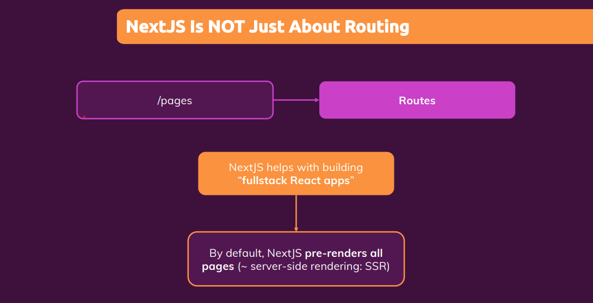
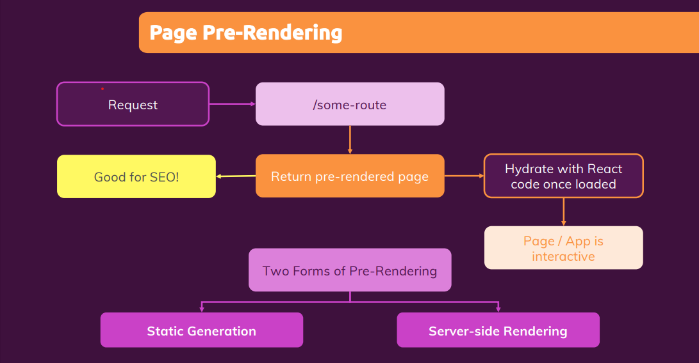
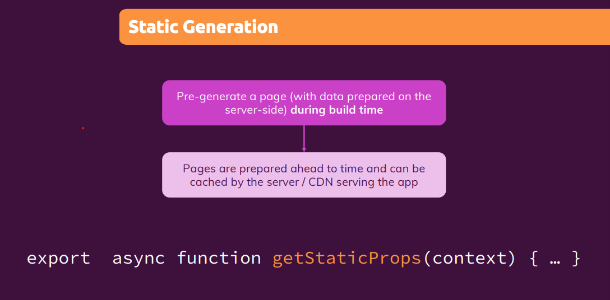
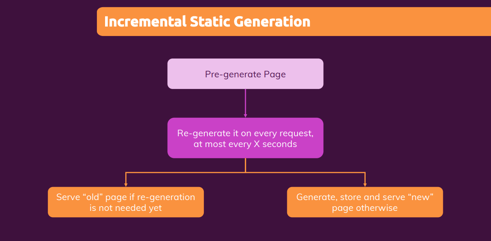
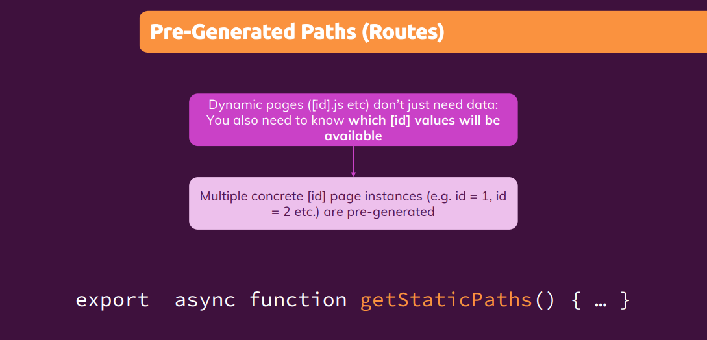
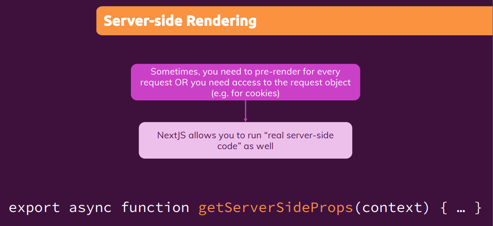
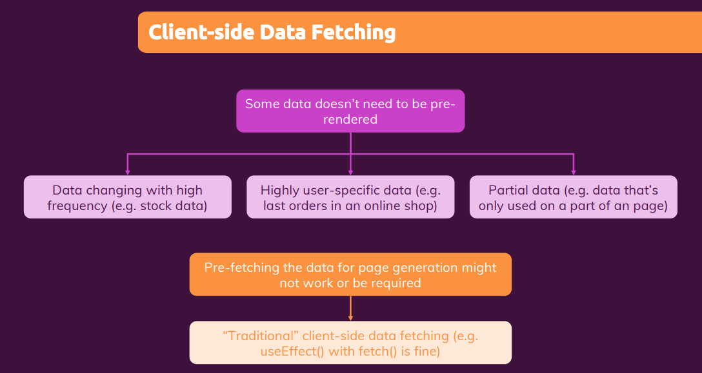

# Page Pre-Rendering & Data Fetching

<p style="text-align: center; font-size: 20px; font-weight: bold; color: #e68a00"> Module Introduction </p>

- Module Content
  - What is "Data Fetching" Exactly
  - Static vs Server-side Page Generation
  - How to fetch Data



---

<p style="text-align: center; font-size: 20px; font-weight: bold; color: #e68a00"> The problem with traditional react apps (and data fetching) </p>

- If you take a standard React application built with just React, then if you inspect the source code of a loaded React
  page, you will notice that the page is actually pretty empty right from the start. You only have a basic HTML skeleton
  there, and then some entry point, some div with an idea route typically, into which the React app is loaded and
  rendered.

- But all of that rendering, is done by React. And since React is a client side, JavaScript library, all that rendering
  happens on the client, so in the browsers of your users, it's not happening on the server. And as a result, the actual
  HTML code, which is sent from the server to the client, when a user visits your page is pretty empty.

- Now, that is not necessarily a big problem. It depends on what you're building, but it can be a problem. Because for
  example, if your page also, fetches some data from a server that should be displayed like a list of meetups, as we're
  doing it here, then the user might initially see some loading state, a flickering page for a fraction of a second,
  whilst the request is on its way, fetching the data because data fetching only begins once the JavaScript code
  executed on the client. And then we still have to wait for the response of that outgoing request.

- Now, again, that is not necessarily a problem, but of course it might not be the user experience you want to offer.
  Now it can also be a problem if search engine optimization matters to you. Now, this does not matter for all pages.
  If you have a administration dashboard which is only reached by logging in, then search engine optimization does not
  matter there because search engines will never see that dashboard. It's highly user specific.

- But if you have a public facing page with a lot of content that should be found through search engines, then of
  course, search engine optimization does matter. So for example, here, where we got this list of meetups, we see those
  meetups as a user but the search engine crawlers will actually only see that initially empty HTML page which we're
  getting from a server. So, that content is not picked up by search engine crawlers and that can be a problem.

- And that's where a server-side rendering could help us. If that page would be pre-rendered on the server, if that data
  fetching somehow could be done on the server, when the request hits that server and then the finished page would be
  served to our users and to the search engine crawlers, then users would not have that flickering loading state and
  search engines would see our page content. And that's the problem server-side rendering solves.

---

<p style="text-align: center; font-size: 20px; font-weight: bold; color: #e68a00"> How Next.js prepares & pre-renders pages</p>



- Instead of loading data only after the page was sent back to the client, Next.js pre-renders a page and pre-renders
  all the HTML content with all the data that might be needed. It loads that in advance and then pre-generates the
  finished HTML page so that it's this finished, fully populated HTML page which can be sent back to the client, so to
  the visitor. So that's great for SEO.

- Now we also of course still want to have an interactive React app. After all, there is a reason why we use React,
  and we don't just build a HTML and CSS app. Instead, we might be using React for handling user interaction, for
  watching a form and showing validation errors, for reacting to button clicks. And therefore Next.js will not just send
  back this pre-rendered page, but it will also send back all the JavaScript code that belongs to it. And it will do
  something which is called hydrating that page. So it will send back that JavaScript code, and that code will then take
  over that pre-rendered page, and again let React do its job.

- That is great because now we have an interactive page or app. But we did send back that pre-rendered page initially,
  so that all the core content was already there right from the start, and so that search engine crawlers, for example,
  also see that entire page with all the content. If it's not interactive at that point, that doesn't matter to those
  crawlers because they are only interested in the content anyways. So that's the idea of pre-rendering.

- And for achieving this, Next.js has two forms of pre-rendering, The first form, and the recommended form, is static
  generation. The other form, the alternative, is server-side rendering.

- The main difference is that with static generation, all the pages are pre-generated in advance during build time.
  So when you build your application for production, before you deploy it, you prepare all those pages. With server-side
  rendering, pages are created just in time after deployment when a request reaches the server.

---

<p style="text-align: center; font-size: 20px; font-weight: bold; color: #e68a00"> Introducing static generation with "getStaticProps" </p>





- Now, because pages are then pre-built during build time, once you deploy them, they can be cached by the server, by
  the CDN that might be serving your app. And therefore, incoming requests can be served instantly with those pre-built
  pages. Now, those pages after they were served, are still hydrated with your React app. So, you still have a regular
  React app in the end.

  The only difference is that the pages which are sent to your clients, are not empty initially but pre populated with
  content. Thereafter, you can still do whatever you want to do.

- And how do we tell Next.js which data is needed to pre-generate a page? And the answer is, there is a specific function
  which we can export from inside our page components. And that's important only from inside our page components, not
  from our React components, but only from inside the component files that live in our pages folder.

  From in there, we can export the special async function, `getStaticProps`. Now, that name matters. It must be written
  exactly like this, getStaticProps, because that is then a function Next.js will watch out for. Its async, which means
  it returns a promise, and you can use the await keyword in there. And then, the special thing is that in this function,
  you can run any code that would normally run on the server side only.

- In that function, you don't run the client side code, you're now restricted to that and you don't have access to
  certain client side API, you don't have access to the window object, for example, but instead, you can run any code
  you want, that normally would only run on the server side. And even better than that, code that you write inside of
  this getStaticProps function, will not be included in the code bundle that's sent back to your clients. So, any code
  you put in there, will never be seen by your clients.

  So, if you for example have code in there that contains database credentials, you typically wouldn't want to expose
  those credentials on the client side. You can safely write it inside of getStaticProps because that code will never
  end up on the client side.

---

<p style="text-align: center; font-size: 20px; font-weight: bold; color: #e68a00"> Next.js Pre-renders by default</p>

- This page, was already pre-rendered by Next.js without us doing anything. It was already pre-rendered because by
  default, Next.js pre-renders all pages that have no dynamic data. And this page of course does not have any dynamic
  data, everything here is just hard coded. And if you have a page like this, Next.js will automatically pre-render it
  for you. Which is great because now any content which you encode in your component will be visible to search engines,
  and to your website visitors, right from the start.

---

<p style="text-align: center; font-size: 20px; font-weight: bold; color: #e68a00"> Adding "getStaticProps" to pages</p>

- This function you then always needs to return an object. An object that has a props key because the function is named
  getsStaticProps. And actually what this function does is it prepares the props for your component. So this props object It prepares that.

  ```js
  export async function getStaticProps() {
    return {
      props: {
        products: [{ is: "p1", title: "product 1" }],
      },
    };
  }

  function HomePage({ products }) {
    return (
      <ul>
        {products.map((product) => (
          <li key={product.id}>{product.title}</li>
        ))}
      </ul>
    );
  }
  ```

---

<p style="text-align: center; font-size: 20px; font-weight: bold; color: #e68a00"> Running server-side code & using the 
Filesystem</p>

- We do wanna load the data when the page is prepared. We don't wanna reach out to that file through a HTTP request or
  anything like that from the client site. And therefore will now utilize the fact that any code inside of getStatiProps
  is executed on the server site so to say with server site capabilities.

  And that means that we can now, for example, work with the file system. For this I'll import Fs from Fs. Now this
  imports the file system module from node JS. This is not a third party package which we needed to install. It's one of
  the core node JS modules instead.

- cwd() stands for Current Working Directory. Now, the important thing here is that this current working directory will
  not be the pages folder. Instead when this file is executed, next JS will be executing it, and it will basically treat
  all the files as if they sit in our root project folder. So the current working directory will be the overall project
  folder instead of the pages folder.

  ```js
  const filePath = path.join(process.cwd());
  ```

---

<p style="text-align: center; font-size: 20px; font-weight: bold; color: #e68a00"> A look behind the scenes</p>

- when you are ready to deploy your next.js application and you run the build step `npm run build`, this next build
  command will then pre-generate your pages.

  After running this build command, .next folder is created, wherein insde server folder we have all pre-generated page.

- In the page source, you'll also see there is some script tag injected by next.js which in the end includes that data,
  with which the data was populated. That is needed for this hydration where the pre-rendered HTML code is then connected
  with the react application and that data which was pre-fetched is handed off to that react application so that the
  react application knows that this was dynamic data and which kind of data should be rendered.

---

<p style="text-align: center; font-size: 20px; font-weight: bold; color: #e68a00"> Utilizing incremental static generation</p>



- What if you have data that changes frequently? Because , pre-generating the pages sounds great if you're building
  something fairly static. If you're building a blog, where data doesn't change too often, then of course, whenever you
  add a new blog post, you can just pre-generate your project again, you can run `npm run build` again, and deploy the
  updated project. So that would work.

  But if you have data that changes more frequently, if we add a fourth product here after the page was deployed, then
  we have to rebuild and redeploy the page all the time. And that doesn't sound like a great thing to do. Well, Next.js
  also has solutions for this.

- Solution number one is that you do pre-build your page, but then you still include standard react code in your react
  components, where you use, useEffect for then fetching updated data from a server. So you would always serve back a
  page with some pre-rendered data, but that data might be outdated.

  So you fetched a latest data in the background and then update the loaded page after that data arrived. That's a
  pattern you could implement. Then you at least chose something to your users, but it might be a bit outdated, but
  that's why you're fetching data in the background, so that you can update the page with the latest data once you got
  that. That might be a perfectly valid pattern.

- There is an alternative which often is better. This getStaticProps function, execute when you build your project with
  next build, so with this build script. Well, that's not entirely true. It does execute there, but that is not
  necessarily the only time it executes.

  Instead, Next.js has a built in feature, which is called incremental static generation. It means that you don't just
  generate your page statically once at build time, but that it's continuously updated even after deployment without you
  re-deploying it. So you pre-generate a page, but then you can also tell Next.js that a given page should be
  re-generated again for every incoming request at most every X seconds. So every 60 seconds, for example.

  That means that if a request is made for a certain page and it's, let's say less than 60 seconds since it was last
  re-generated, the existing page would be served to the visitor. But if it's past those 60 seconds and the amount of
  seconds of course is up to you, then this page would be pre-generated on the server instead.

  So that means that you either serve the old page if it's not that old yet, or you serve the latest page and brand new
  page, which was generated again on the server otherwise. And if that page was pre-generated again on the server,
  because it was outdated, then this newly generated page will replace the existing old page on the server. It will be
  cached and future visitors will see that re-generated page instead. Until 60 seconds passed again, and then new page
  is pre-generated again.

- And all you need to do to unlock this is in the object, which you return in get static props. You don't just return
  props, but you also add a second key, which is called revalidate. And as a value, you set a number a year, which is
  the time in seconds that Next.js should wait until it re-generates this page.

  ```js
  export async function getStaticProps() {
    console.log("Re-gererating...");
    const filePath = path.join(process.cwd(), "data", "dummy-backend.json");
    const jsonData = await fs.readFile(filePath);
    const data = JSON.parse(jsonData);

    return {
      props: {
        products: data.products,
      },
      revalidate: 10,
    };
  }
  ```

---

<p style="text-align: center; font-size: 20px; font-weight: bold; color: #e68a00"> ISR: A look behind the scenes</p>

- Run `npm run build` then run `npm run`. Check log in terminal and then refresh page and then see terminal's log.

---

<p style="text-align: center; font-size: 20px; font-weight: bold; color: #e68a00"> A closer look at "getStaticProps" & configuration options</p>

- getStaticProps() also get context as parameter.
- Now in objects, we have two more key - notFound,

  `notFound` : We can pass tru or false here, if we pass true then this page will return 404 error and therefore ender the 404 error page instead of normal page. We can pass this based on some condition, let's say if we have problem in fetching data or we don't find any data.

  ```js
  export async function getStaticProps(context) {
    console.log("Re-gererating...");
    const filePath = path.join(process.cwd(), "data", "dummy-backend.json");
    const jsonData = await fs.readFile(filePath);
    const data = JSON.parse(jsonData);

    if (data.products.length === 0) {
      return { notFound: true };
    }

    return {
      props: {
        products: data.products,
      },
      revalidate: 10,
      <!-- notFound: true, -->
    };
  }
  ```

  `redirect`: The redirect key allows you to redirect the user. So instead of rendering the page content, instead of
  rendering this component content you can redirect to another page, to another route. And that could also be needed
  because maybe you failed to fetch data. Let's say the problem is not that there is no data but instead you weren't
  able to access the database or anything like that.

  So if there is no data to begin with so not just no products, but no data in general then maybe you want to redirect.
  Then you can do this by returning an object where the redirect key is set to an object, where you then set a
  destination to some route.

  ```js
  export async function getStaticProps(context) {
    console.log("Re-gererating...");
    const filePath = path.join(process.cwd(), "data", "dummy-backend.json");
    const jsonData = await fs.readFile(filePath);
    const data = JSON.parse(jsonData);

    if (!data) {
      return {
        redirect: {
          destination: "/no-data",
        },
      };
    }

    return {
      props: {
        products: data.products,
      },
      revalidate: 10,
    };
  }
  ```

---

<p style="text-align: center; font-size: 20px; font-weight: bold; color: #e68a00"> Working with dynamic parameters</p>

- If you plan on preparing a page on the server or during the build process with getStaticProps, then you need to get
  access to the params, so to that dynamic path segment inside of getStaticProps so that you can use the param data here
  to prepare the data for the component.

  ```js
  export async function getStaticProps(context) {
    const { params } = context;
    const { pid } = params;

    const filePath = path.join(process.cwd(), "data", "dummy-backend.json");
    const jsonData = await fs.readFile(filePath);
    const data = JSON.parse(jsonData);

    const product = data.products.find((product) => product.id === pid);

    return {
      props: {
        loadedProduct: product,
      },
    };
  }
  ```

- If you click on products link, you get below error.

  

<p style="text-align: center; font-size: 20px; font-weight: bold; color: #e68a00"> Introducing "getStaticPaths" for dynamic pages</p>

- 

- Next.js pre-generate pages by default. It turns out this is not the case if you have a dynamic page, so where the name
  of the component has such square brackets. If you have a dynamic segment leading to that page, if you have that, the
  default behavior is not to pre-generate the page.

  And why is that not the default, because keep in mind that technically for a this page, we won't just have one page,
  but multiple pages for different IDs, we have technically different pages which have kind of the same frame and the
  same general HTML content, but different data.

  This page can be loaded /P1/P2/P1000. So Next.js doesn't know in advance, how many pages it needs to pre-generate
  for this dynamic page. It doesn't know which values for PID will eventually be supported. And because it doesn't know
  that dynamic pages like this are not pre-generated by default instead they are always generated just in time on the
  server, Which is why it worked before. But it's now not working anymore because we added get static props.

- That's why for such dynamic routes, we need to give Next.js more information. We can also tell Next.js which paths.
  So which instances off a dynamic page should be pre-generated.

  And we do inform Next.js about this with another function and that's the getStaticPaths function, which also is a
  async. That's a function which you can add to your page component files and only there. So not in any other component
  files and you need to export it to make Next.js aware of it.

<p style="text-align: center; font-size: 20px; font-weight: bold; color: #e68a00"> Using "getStaticPaths" </p>

```js
export async function getStaticPaths() {
  return {
    paths: [
      { params: { pid: "p1" } },
      { params: { pid: "p2" } },
      { params: { pid: "p3" } },
    ],
    fallback: false,
  };
}
```

<p style="text-align: center; font-size: 20px; font-weight: bold; color: #e68a00"> "getStaticPaths" & Link Prefetching: Behind the Scenes</p>

- if we dive into the .next folder again, into server pages. Here we see the HTML files for those different parameters.
  We also see the json files for pre-loading that data if we would navigate to such a page through a link. So after we
  already are on the page. Not for the initial page load. And if we have a look at those HTML files, in there, of
  course, ultimately somewhere we will see our product one text.

- If I now reload, localhost:3000 you'll see something interesting. You see here in network tab, are requests to p1.json,
  p2.json and p3.json. And if you click on them, you see what was fetched. And in the end here, it pre fetched the props.
  Now the exact point of time when data is pre fetched, that's something figured out and done by next.js.

  The important part for us here is that it does that pre fetching for us. Now, when we now click on a link, we're not
  sending a new request to the server and load the pre-rendered HTML file. Instead we stay in this single page
  application now. We stay here in this react application which was loaded and hydrated after this initial request.

  So in the end now JavaScript will render a new page for uS. Just as it would do in a regular react app without next JS.
  But the data needed for this page is coming from the pre fetched JSON file, which is loaded and read under the hood on
  our behalf. So that it doesn't need to fetch the data after we navigated to that page.

<p style="text-align: center; font-size: 20px; font-weight: bold; color: #e68a00"> Working with fallback pages </p>

- Now imagine that you have like an Amazon-like website with millions of products. Of course, pre-generating all those
  products like this might not be optimal. We could fetch this dynamically from this file, so that's not the problem,
  but simply because pre-generating all those millions of pages might take super long, and there might be products,
  which are rarely visited.

  If you're building a blog and you have hundreds of articles, you might have some articles which are basically never
  read. So then, pre-generating such rarely visited pages is a waste of time and resources. That's where fallback
  becomes important.

- With fallback set to true, you will notice that if I go back to the starting page, if I click on product three,
  we still load this page successfully. Even though it was not added here to paths. And the reason for that is that with
  fallback true, we tell Next.js that even pages which are not listed here. So even parameter values for the PID
  parameter, which are not listed here, can be valid. Values that should be loaded when they are visited.

  But they're not pre-generated, instead they're generated just in time when a request reaches the server. And that
  allows us to pre-generate highly visited pages, and postpone the generation to less frequented pages to the server, so
  that they are only pre-generated when they're needed.

  ```js
  export async function getStaticPaths() {
    return {
      paths: [{ params: { pid: "p1" } }],
      fallback: true,
    };
  }
  ```

- There is a slight problem here, if we directly enetr the path in URL then we see error. The reason for that, is that
  this pre-generation, this dynamic pre-generation, when it's needed, does not finish instantly. So therefore instead
  when using this fallback feature, you should be prepared to return a fallback state in your component. For example, by
  simply checking if loadedProduct is maybe not a thing with if not, and then returning something like loading here.
  if you now reload this page, you'll see loading briefly and then Next.js will automatically give you that data
  once it's done loading.

- An alternative would be that you don't set fallback to true or false, but to a string with a value of blocking. If you
  do that, then you don't even need that fallback check here in the component, and hence we can comment this out,
  because then Next.js will actually wait for this page to fully be pre-generated on the server before it serves that.
  So then it will take a little bit longer for the visitor of the page to get a response, but the response which is sent
  back will be finished.

<p style="text-align: center; font-size: 20px; font-weight: bold; color: #e68a00"> Loading paths dynamically </p>

- At the moment the way we use it is still a bit unrealistic though because I have hard coded my PID values here into
  this getStaticPaths(). And in reality, we would be fetching this kind of information from a database or a file as well.

  ```js
  async function getData() {
    const filePath = path.join(process.cwd(), "data", "dummy-backend.json");
    const jsonData = await fs.readFile(filePath);
    const data = JSON.parse(jsonData);
    return data;
  }

  export async function getStaticPaths() {
    const data = await getData();

    const ids = data.products.map((product) => product.id);
    const pathsWithParams = ids.map((id) => ({ params: { pid: id } }));

    return {
      paths: pathsWithParams,
      fallback: "blocking",
    };
  }
  ```

---

<p style="text-align: center; font-size: 20px; font-weight: bold; color: #e68a00"> Fallback pages & "Not Found" Pages</p>

- Let's start by simply visiting a page with a product ID of P4. Now we get a 404 error page here. Now we get this not
  found error because in getStaticPaths, we load and build our array of IDs our array of routes or of parameters for
  which pages should be generated

- What if we use fallback: true though? What if we for example assume that the products stored in dummy-backend.json
  might not be all the products for which we are able to fetch data. So we only generate pages for the three product IDs
  we find in that file, because we go through that file here in getStaticPaths but by setting fallback to true, we then
  also tell Next.js that even if an ID value is not found here we still might be able to render a page. That's what the
  idea behind fallback is that we don't have to predefine all possible pages.

  ```js
  export async function getStaticPaths() {
    const data = await getData();

    const ids = data.products.map((product) => product.id);
    const pathsWithParams = ids.map((id) => ({ params: { pid: id } }));

    return {
      paths: pathsWithParams,
      fallback: "true",
    };
  }

  const ProductDetailPage = ({ loadedProduct }) => {
    if (!loadedProduct) {
      return <p>Loading...</p>;
    }

    return (
      <Fragment>
        <h1>{loadedProduct.title}</h1>
        <p>{loadedProduct.description}</p>
      </Fragment>
    );
  };
  ```

---

<p style="text-align: center; font-size: 20px; font-weight: bold; color: #e68a00"> Introducing "getServerSideProps" for Server-side Rendering(SSR)</p>

- 

- Inside of getStaticProps and also inside of getStaticPaths, we don't have access to the actual request which is
  incoming. Because these functions are not called for the actual request, at least not only. With incremental static
  generation, they are also called for incoming requests at least sometimes if they need to be re-validated but they are
  generally called when your project is built. So inside of getStaticProps, you don't have access to the actual incoming
  request.

- But sometimes static generation is not enough and instead, you need real server-side rendering, which means that you
  do need to pre-render a page for every incoming request. So not at most every second but really for every incoming
  request and/or you need access to the concrete request object that is reaching the server. Because, for example, you
  need to extract cookies.

- Next.js also supports this run real server-side code use case which means it gives you a function which you can add to
  your page component files, which is then really executed whenever a request for this page reaches the server. So
  that's then not pre-generated in advance during build time or every couple of seconds but it's really code that runs
  on the server only, so only after you deployed it, and which is then re-executed for every incoming request. And that
  code is added to a function called getServerSideProps. Just like getStaticProps, it's a async function. It needs to be
  called exactly like this and it needs to be exported. And you can only add it to your page component files.

<p style="text-align: center; font-size: 20px; font-weight: bold; color: #e68a00"> Using "getServerSideProps" for 
Server-side Rendering</p>

- The important thing now really is that this only executes on the server after deployment and also on our development
  server here, but it's not statically pre-generated.

  ```js
  export async function getServerSideProps(context) {
    return {
      props: {
        username: "Max",
      },
    };
  }
  ```

---

<p style="text-align: center; font-size: 20px; font-weight: bold; color: #e68a00"> Using "getServerSideProps" and its 
context</p>

- unlike context in getStaticProps we don't just have access to the params and a couple of other less important fields
  instead, we get access to the full request object as well. And also to the response which will be sent back so that we
  could even manipulate this and add extra headers if you wanted to. we still would get access to params but in
  addition, we also get access to the request object and the response object.

- In addition, you can also dive into the request object that reached the server and you can read incoming data from
  there. For example, headers that were attached through request and therefore cookie data that was attached to the
  request. Request and response the objects we're getting here are your official Node.js default incoming message and
  response objects.

  ```js
  export async function getServerSideProps(context) {
    const { params, req, res } = context;

    console.log(req);
    console.log(res);

    return {
      props: {
        username: "Max",
      },
    };
  }
  ```

- The only key difference is the kind of data you get access to in the context and the timing of this function.

---

<p style="text-align: center; font-size: 20px; font-weight: bold; color: #e68a00"> Dynamic pages & 'getServerSideProps'</p>

- Here before, when we used getStaticProps, we also needed getStaticPaths to let Next.js know which instances of this
  page should be pre-generated. Now when using getServiceSideProps, that's not the case.

  ```js
  export async function getServerSideProps(context) {
    const { params } = context;

    const userId = params.uid;

    return {
      props: {
        id: "userid-" + userId,
      },
    };
  }
  ```

---

<p style="text-align: center; font-size: 20px; font-weight: bold; color: #e68a00"> "getServerSideProps": Behind the Scenes</p>

- Run npm run build and then npm run and check terminal log

---

<p style="text-align: center; font-size: 20px; font-weight: bold; color: #e68a00"> Introducing client-side data fetching(and when to use it)</p>

- 

- When building next.js applications, you will sometimes have data which just doesn't need to be pre-rendered, or which
  can't be pre-rendered. Examples would be data that changes with high frequency. So for example, if you have stock data
  which you show on some page and that data changes multiple times every second, pre fetching and pre rendering might
  not make too much sense because you will always see outdated data when you visit this page.

- Another example would be highly user-specific data. For example, the last orders in an online shop. If you are in your
  account and your user profile and you view that data, that could be an example where we don't really need to
  pre-render a page. Definitely not for search engines because they won't see your private profile, and also not
  necessarily for the user experience because if we go to this page, we might be more than fine with just waiting a
  second for the data to be loaded on the client and having a quicker navigation to the page might be more important
  than having the data available right from the start.

- Another example would be highly user-specific data. For example, the last orders in an online shop. If you are in your
  account and your user profile and you view that data, that could be an example where we don't really need to
  pre-render a page. Definitely not for search engines because they won't see your private profile, and also not
  necessarily for the user experience because if we go to this page, we might be more than fine with just waiting a
  second for the data to be loaded on the client and having a quicker navigation to the page might be more important
  than having the data available right from the start.

---

<p style="text-align: center; font-size: 20px; font-weight: bold; color: #e68a00"> Implementing client-side data fetching</p>

- Refer last-sale.js

---

<p style="text-align: center; font-size: 20px; font-weight: bold; color: #e68a00">Using the "useSWR" Next.js hook</p>

- Now, you can absolutely write this client side data fetching code on your own, as we did it here, there's nothing
  wrong with that. And you might have good reasons to do that because this, of course, gives you full control over the
  entire component state, and how exactly data is being fetched. But this is also such a common pattern that you could
  consider creating your own custom hook to outsource this logic into it, or to use a third-party hook created by
  someone else. And you can look into the SWR hook. and it stands for Stale While Revalidate

- In the end, this is a hook which, under the hood, still will send a HTTP request by default using the fetch API, which
  we also used, but it gives you a couple of nice built in features like caching and automatic revalidation retries on
  error. And you don't have to write all that code on your own. `npm install swr`

---

<p style="text-align: center; font-size: 20px; font-weight: bold; color: #e68a00">Combining pre-fetching with client-side fetching</p>

- Now we're using fetch here, you can use fetch here in getStaticProps and getServerSideProps as well. Next.js ensures
  that this also is available in this context. So on the service side.

- Refer last-sales.js

---

<p style="text-align: center; font-size: 20px; font-weight: bold; color: #e68a00">Module Summary</p>
