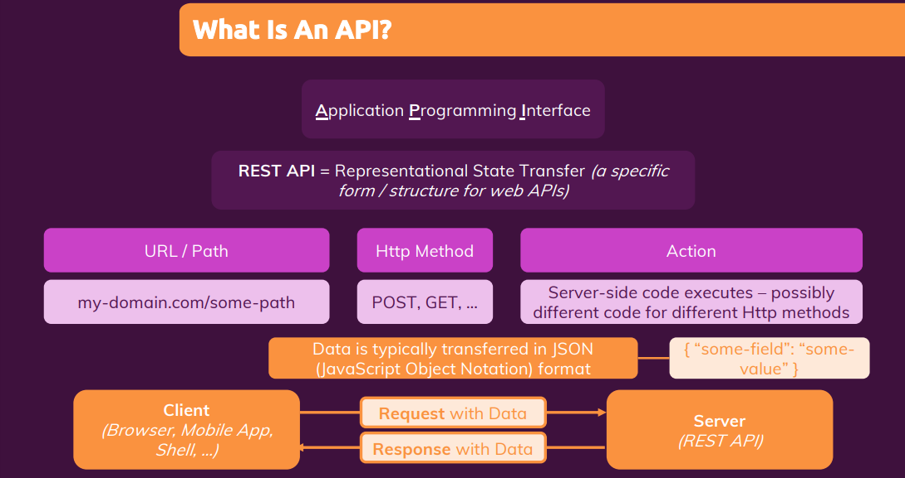
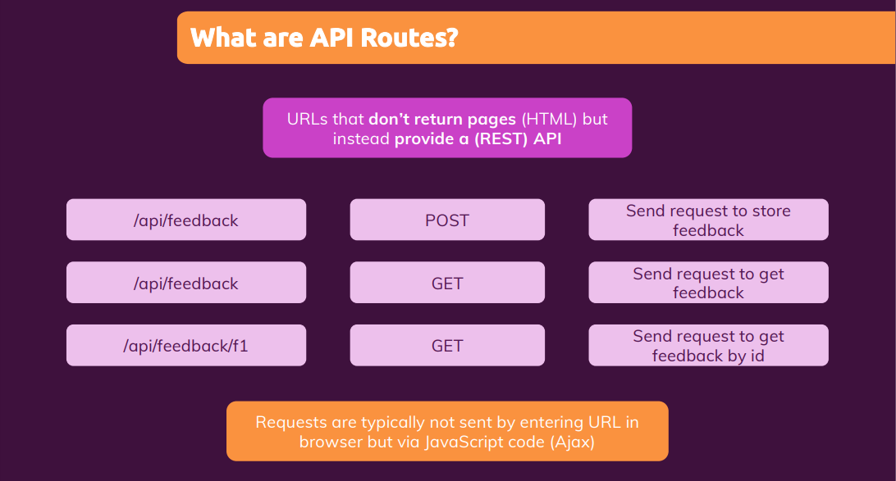

# Adding backend code with API routes (Fullstack react)

<p style="text-align: center; font-size: 20px; font-weight: bold; color: #e68a00"> Module Introduction </p>

- Module Content
  - What are API Routes?
  - Adding & using API routes
  - Working with requests & responses

---

<p style="text-align: center; font-size: 20px; font-weight: bold; color: #e68a00"> What are "API routes"? </p>

- 

- Some websites which we're building don't just need HTML pages that are being served back to visitors upon requests.
  That of course is something which most websites need but it's not the only thing that can be needed by a website.
  You might, have a feature on your website that allows users to submit feedback or sign up for a newsletter. Now, when
  a user clicks such a button to for example sign up for a newsletter, you don't necessarily want to show a different
  page. I mean you could show a confirmation page that it was successful, but you could also just show a little info
  pop-up or a banner on the existing page.

  But even if we ignore what we show let's think about what happens behind the scenes when we sign up for a newsletter.
  Then we need to send data to some server to some computer to then store that entered newsletter email address in some
  database. And that request which is being sent there is not about fetching a site. It is about storing data. So it's
  kind of the other direction.

  

  We don't want to get a HTML page. Instead. We want to send that user entered data to some database. And that is what
  we use APIs for Application Programming Interfaces. There are different kinds of APIs we could build. REST APIs are
  the most popular form of APIs. And the idea is always the same that we have a web server that exposes certain URLs.
  Just as we did it thus far in the course but those you are URLs are not about getting requests and sending back HTML
  data, but they are about accepting some data and then sending back responses with any kind of data, not necessarily
  HTML.

  

  Specifically JSON, JavaScript Object Notation, would be the most common format for exchanging such data. So API routes
  are special kind of you are URLs, which you can add to your Next.js application, which are not about getting a
  standard browser request and sending back a pre-rendered HTML page, but which are instead about getting data, using
  data, maybe storing data in some database and sending back data in any form of your choice. So in the end API routes,
  this Next.js feature is a feature that allows us to build a API, a REST API if you will, as part of our Next.js app.

---

<p style="text-align: center; font-size: 20px; font-weight: bold; color: #e68a00"> Writing our first API Route </p>

- Now I have that feedback.js file in the API folder in the pages folder. Now that will create a special path, we can
  send requests to. It will allow us to send requests to our domain. So during development, that's local host 3000/API/feedback.

- we don't export a react component here. So in the upper page files, we do create a react component and export that as
  a default. We don't do that in API routes. Instead here, we create a function, a function which we typically should
  name, handler because it will handle incoming requests and a function which will get two parameters, a request object,
  which we could name, req and a response object which we could name res.

- Now inside of this function, we can not just handle get requests and we don't have to send back HTML code. Instead,
  this allows us to execute any server side code of our choice and that's important server side code. Any code we write
  in here, will never end up in any client side code bundle.

- Below code will be executed by next.js when we send the request to /API/feedback and this code will then send back a
  respons clearly not a page, clearly not an HTML response but instead some JSON data because this response is not
  intended to be consumed by entering this in the browser.

  ```js
  function handler(req, res) {
    res.status(200).json({ message: "This works!" });
  }

  export default handler;
  ```

---

<p style="text-align: center; font-size: 20px; font-weight: bold; color: #e68a00"> Preparing the frontend form </p>

- Refer pages/index.js

---

<p style="text-align: center; font-size: 20px; font-weight: bold; color: #e68a00"> Preparing the incoming request & executing server-side code </p>

- ```js
  function handler(req, res) {
    if (req.method === "POST") {
      const email = req.body.email;
      const feedbacktext = req.body.text;

      const newFeedback = {
        id: new Date().toISOString(),
        email: email,
        text: feedbacktext,
      };

      // store that in a database or in a file
      const filePath = path.join(process.cwd(), "data", "feednback.json");
      const fileData = fs.readFileSync(filePath);
      const data = JSON.parse(fileData);
      data.push(newFeedback);
      fs.writeFileSync(filePath, JSON.stringify(data));

      // Send response
      res.status(201).json({ message: "Success!", feedback: newFeedback });
    } else {
      res.status(200).json({ message: "This works!" });
    }
  }
  ```

---

<p style="text-align: center; font-size: 20px; font-weight: bold; color: #e68a00"> Sending Requests to API Routes</p>

```js
function submitFormHandler(event) {
  event.preventDefault();

  const enteredEmail = emailInputRef.current.value;
  const enteredFeedback = feedbackInputRef.current.value;

  const reqBody = { email: enteredEmail, text: enteredFeedback };
  console.log(reqBody);

  fetch("/api/feedback", {
    method: "POST",
    body: JSON.stringify(reqBody),
    headers: {
      "Content-Type": "application/json",
    },
  })
    .then((response) => response.json())
    .then((data) => console.log(data));
}
```

---

<p style="text-align: center; font-size: 20px; font-weight: bold; color: #e68a00"> Using API Routes to get data</p>

- Now we know what API routes are, that we can write server-side code there, Node.js code to be specific, that we can
  handle different kinds of requests, that we can extract data, and then run any kind of Node.js code we want. We can
  then also send back a response or different responses depending on the kind of request sent.

- Refer pages/index.js

---

<p style="text-align: center; font-size: 20px; font-weight: bold; color: #e68a00"> Using API Routes for pre-rendering pages</p>

- Whilst this is absolutely fine for external APIs like the Firebase API, you should not use fetch inside of
  getStaticProps or getServerSideProps to talk to your own API. Instead since this is all part of one project and
  therefore ultimately all served by one server. What you should do instead is write any note JS logic that should
  execute here directly inside of getStaticProps.

- Code used in getStaticProps and dependencies used in there so imports used in there will not end up in the client side
  code bundle if we're not using that code anywhere in our client side code.

  ```js
  import { buildFeedbackPath, extractFeedback } from "../api/feedback";

  function FeedbackPage(props) {
    return (
      <ul>
        {props.feedbackItems.map((feedback) => (
          <li key={feedback.id}>{feedback.text}</li>
        ))}
      </ul>
    );
  }

  export async function getStaticProps() {
    const filePath = buildFeedbackPath();
    const data = extractFeedback(filePath);

    return {
      props: { feedbackItems: data },
    };
  }
  ```

---

<p style="text-align: center; font-size: 20px; font-weight: bold; color: #e68a00"> Creating & using dynamic API Routes 
</p>

- You also wanna support /api/feedback/some-feedback-ID to just fetched a single piece of data for that specific
  feedback item, because maybe you need that somewhere on your page.

- We can use a similar feature for API routes as we use for dynamic routes, because it's also not unrealistic that we
  wanna send the request to /api/feedback and then the ID of a specific feedback to then load the data for that specific
  feedback. And for this, we need a new file. Hence in the API folder, we can add a dynamic API route and we do that in
  exactly the same way as we do it for a regular pages. We use square brackets and then any place holder name of our
  choice, like for example id or feedbackId or whatever you want.

- Refer api/[feedbackId].js, feedback/index.js

---

<p style="text-align: center; font-size: 20px; font-weight: bold; color: #e68a00"> Exploring different ways of strcturing API route files </p>

- Now it is worth a note that there are some alternatives to how we name and structure our files inside of the API
  folder. For example, you can also have catch-all dynamic API routes by adding three dots in front of any placeholder
  name of your choice eg: [...feedbackId].js. This will then not just handle requests to /API/some value, but also to
  more segments you might have.

- Now, another important thing to know is that you have some flexibility regarding how you structure your files. You can
  add a feedback.js file in the API folder to support requests to /API/feedback. Alternatively, just as with the regular
  pages, you could also add a feedback sub folder in the API folder and then move to file in there and rename it to
  index.js. /api/feedback/index.js
