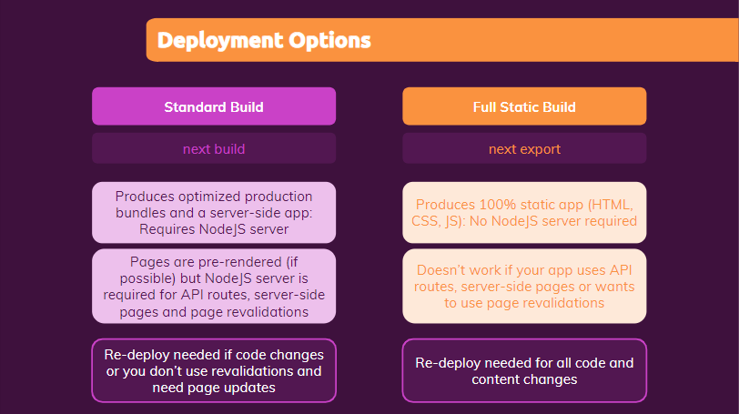
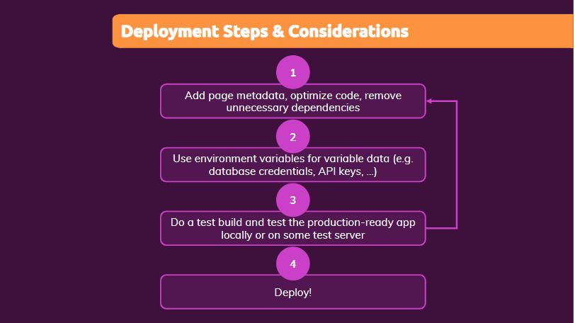
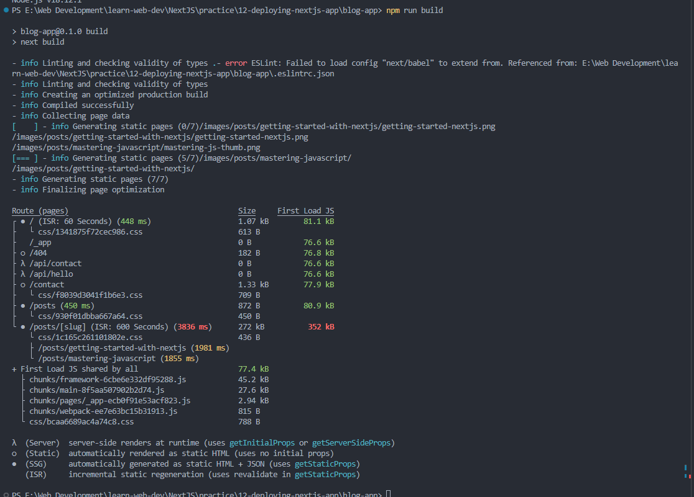

# Deploying NextJS Apps

---

<p style="text-align: center; font-size: 20px; font-weight: bold; color: #e68a00"> Module Introduction </p>

- Module Content
  - Different deployment options
  - Configuring & Prepaing the project
  - Deployment in Action!

---

<p style="text-align: center; font-size: 20px; font-weight: bold; color: #e68a00"> Building NextJS Apps : Your Options </p>

- 

- You have two totally different ways of building and deploying your Next.js app. The first and most common option is
  the `Standard Build`, But we also can actually do a `Full Static Build` and deploy our site as a full static website.

## Standard Build

- You do a standard build by running the `next build` command or in your project, where you have a package.json file,
  this build script which runs next build under the hood. When running this command, Next.js produces a optimized
  production build, optimized production bundles for your application and very important, it spits out a service-side
  application.

  The result of running next build is an output that requires a NodeJS server to run it. So you can't take the output of
  next build and put it onto some static host. You would be able to do that for a standard React app, a non Next.js app,
  but because Next.js has these built-in service-side capabilities, like pre-rendering pages on the fly, on the server,
  revalidating pages, API routes. Because it has these service-side features, it needs a NodeJS server to run that code,
  should make sense.

- Pages will still be pre-rendered during the build process if possible. So if you have pages with getStaticProps or
  with no data at all, those pages will still be prebuilt when you run next build. But you still have the NodeJS server,
  as I just explained, for your API routes, which can and should only run on the server, for server-side pages that use
  the getServerSide props function and for page revalidations, which you might wanna perform on your statically rendered pages.

  You also need a NodeJS server for dynamic pages with getStaticPaths if you have fallback set to true or blocking,
  because then some of the pages will be created on the fly when requests are reaching the server. And you need a server
  that is able to do that for that as well. So that is why you need a NodeJS server for running the output next build
  gives you. And that has implications. It means that when you deploy that output, you need to deploy it onto a host
  that is able to run NodeJS.

- Now when deploying a site, an application you also typically need to redeploy from time to time. And when doing a
  standard build, you need to redeploy whenever your code changes, of course because you want your latest code to be in
  effect in production, but you will also need to redeploy if your content changed and you need to re-render some of
  your pages because you're not revalidating them on the server because you haven't added that revalidate setting in
  getStaticProps.

## Full Static Build

- For some projects, the full static build is a good option though. You get that by running `next export`, another
  command.

  ```js
  "scripts": {
      "dev": "next dev",
      "build": "next build",
      "start": "next start",
      "lint": "next lint",
      "export": "next export"
    },
  ```

  Now `next export` does something totally different than next build. It also produces an optimized production version
  of your application but it produces a 100% static application, which means only HTML, CSS and JavaScript, no
  server-side code and therefore for hosting such a website, you don't need a NodeJS server. Which makes hosting easier
  because you don't need to worry about scaling and so on, so much because there are plenty of static hosts out there
  which scale dynamically and are very cost-effective. So having a static app, which doesn't require a NodeJS server,
  isn't too bad. It can definitely make deployment a bit easier

- But `next export` isn't always an option. Since it spits out a 100% steady gap, there are certain things, certain next
  features which you just can't use in such a application. For example, you can't use next export if your site relies on
  API routes, on service-side pages with get service-side props, on page revalidations, or if you have static paths with
  fallback set to true or blocking.

  All those things require a code to execute on demand, for incoming requests on the server. And therefore it's
  difficult, if you have no server. So next export only works if you have a page which doesn't need any service-side
  code. Now, when building a page with next export, you have to be aware of the fact that that means that you need to
  redeploy your application whenever your code changes but also whenever any content changes, since you can't use page
  revalidations and fallbacks and so on, you need to redeploy whenever any content changed because you'll need to export
  your application again. You need to rebuild all the pages again.

- Again, that might not be a disadvantage. That can be perfectly fine for a simple blog, for example. There you add a
  new blog post every week, you do a redeployment every week. Not too difficult, just one step, and then next export can
  be a great option. In the blog application we built in the last course section, next export wouldn't be our option at
  the moment because we're using API routes, for example and because we're also using revalidations in some pages and
  these are all features that require a NodeJS server, since these are all tasks which will execute after deployment
  on the server for incoming requests.

---

<p style="text-align: center; font-size: 20px; font-weight: bold; color: #e68a00"> Key Development Steps </p>

- 

- In our blog application we have an API route where I connect to a database, and, at the moment, the way I connect here
  is always the same. My connection string is hard-coded in the API route, so I always use the same user, the same
  cluster, the same database. It's more realistic that I want to use some development dummy database during development
  and switch to a different database and maybe also an entirely different cluster and user for production.

  And, therefore, we want to swap this connection string dynamically, depending on the environment in which we're
  running. And that is something where environment variables will be able to help us. Another usecase could be API keys.
  If you're using the Google Maps SDK, for example. These are things which you might wanna manage with environment
  variables.

---

<p style="text-align: center; font-size: 20px; font-weight: bold; color: #e68a00"> Checking & Optimizing our code </p>

- Use next-image : This is a great optimization because that loads images only when they are needed. It loads them
  lazily, and it also shrinks them in size.

- Now, speaking of lazy loading, that also is a concept we know in general in React, and most prominently when working
  with just React, without NextJS, you might want to lazy load your routes. So that the code for a given page is only
  downloaded if you're visiting that page, and it's not downloaded if you not visit the page. The great thing here is
  that NextJS has this kind of lazy loading built in. You don't need to worry about it. Your different pages, which we
  have here, are already lazy loaded. So the code for them is only fetched on demand, when we visit a page. So that
  built-in lazy loading is a very nice feature to have.

- Now regarding the metadata, which we should add. I'm happy with the amount of metadata, like title, and this
  description tag I added in the last course section. Of course, there is more you might want to add. Favicons, images
  which are displayed if you share a page through Facebook or Twitter. So these little preview images and so on. These
  are all extra kinds of data you could add into your head section, but for this demo here for this project, the current
  amount of metadata which we added, is fine for me.

---

<p style="text-align: center; font-size: 20px; font-weight: bold; color: #e68a00"> The NextJS config file & working with environment variables </p>

- Now step number two, is about those environment variables. And that's a very useful feature, since it allows us to use
  different values in parts of our code, during development and production. And Next.js has built-in support for
  environment variables.

- Now to explore them, I actually wanna explore another of concept first though. We can configure Next.js. Up to this
  point, this Next.js project worked with all the default settings Next.js assumes. And these are a sensible default,
  which often makes sense. But maybe you want to fine-tune them. And you can do this by adding a special file to your
  project a next.config.js file. This is a special file which has to be named like this and which has to sit in your
  root project folder, if you add it. And it's a file, which exports a JavaScript object with this Node.js export syntax.

- For detail follow - https://nextjs.org/docs/pages/api-reference/next-config-js

- You can, for example add environment variables, You could add a basePath if you're hosting your next website, not on
  the root level of some domain, but in some nested path. You can set up rewrites and redirects, if you have some
  hard-coded redirects, which should be taken into account when the application is deployed and much more. You can
  inject your own Webpack configuration to really tap into that build process. You can disable compression, it's enabled
  by default, but you can disable it if you don't wanna use it for whatever reason.

  Compression will make your JavaScript files and so on smaller. So you should enable it by default and much more. So
  you see, there are a couple of things you can set, but to be honest most of the settings will rarely be needed. The
  most helpful settings are probably redirects and custom headers and environment variables and the basePath.

- And to make that work, I'll go to that next config file and add the env key. This allows you to set up key value pairs
  of your choices and you will then be able to use your keys in your code both in the API routes, as well as in any
  other component. So you can use your environment variables anywhere in your code base. Now you might be wondering why
  I'm doing this here. What's the benefit. The benefit is that now we can tap into those values. Now you might be
  wondering why I'm doing this here. What's the benefit. The benefit is that now we can tap into those values.

  ```js
  const nextConfig = {
    reactStrictMode: true,
    env: {
      mongodb_username: "jitendrakr54",
      mongodb_password: "Jitendra",
      mongodb_clustername: "cluster0",
      mongodb_database: "blog-app",
    },
  };

  const connectionString = `mongodb+srv://${process.env.mongodb_username}:${process.env.mongodb_password}@${process.env.mongodb_clustername}.imkouor.mongodb.net/${process.env.mongodb_database}?retryWrites=true&w=majority`;

  MongoClient.connect(connectionString);
  ```

- At the moment we don't differentiate between production and development. Now there will be certain hosting providers
  which allow us to push our code to them and then they will do the build for us. And then there we can define different
  environment variables which they should use during the build process. but we're not necessarily always using a hosting
  provider that does to build for us. And therefore for in next.config.js, we can actually define different values for
  the environment variables, for the different phases we might be in.

- But we're not necessarily always using a hosting provider that does to build for us. And therefore for in next.config.
  js. we can actually define different values for the environment variables, for the different phases we might be in.
  If we run NPM run build though to trigger the next build script, or if we run the export script then we are clearly
  building for production because that's the idea behind next build and next export. So then our phase is production.
  We want to use the production values.

  And because we have this clear way of telling Next.js whether we're building for development or production. Next.js
  allows us to define different sets of configuration values for development and production.

  ```js
  const { PHASE_DEVELOPMENT_SERVER } = require("next/constants");

  /** @type {import('next').NextConfig} */

  const nextConfig = (phase) => {
    if (phase === PHASE_DEVELOPMENT_SERVER) {
      return {
        env: {
          mongodb_username: "jitendrakr54",
          mongodb_password: "Jitendra",
          mongodb_clustername: "cluster0",
          mongodb_database: "blog-app-dev",
        },
      };
    }

    return {
      env: {
        mongodb_username: "jitendrakr54",
        mongodb_password: "Jitendra",
        mongodb_clustername: "cluster0",
        mongodb_database: "blog-app",
      },
    };
  };

  module.exports = nextConfig;
  ```

---

<p style="text-align: center; font-size: 20px; font-weight: bold; color: #e68a00"> Running a test build & reducing code size </p>

- 

- npm run build

- But here we see an issue. This is red because this posts detailed page. These pages are too big, they contain too much
  JavaScript. We could deploy it, it wouldn't break but this is a clear indicator that we might be doing something in
  those pages which is not optimal. We might be shipping too much code. And very often that means that you're using some
  third party package, some third party library that is too big. So therefore, before we deploy something, let's fix
  this issue.

- In post-content, we use SyntaxHighlighter library which causes our file to be of more size. So we use lighter version
  of it.

- Refer components/posts/post-content.js
