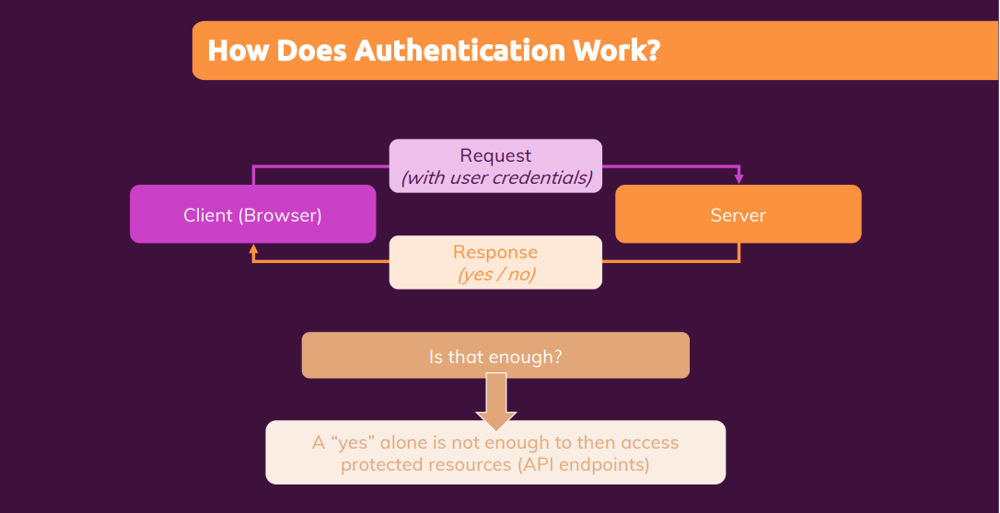
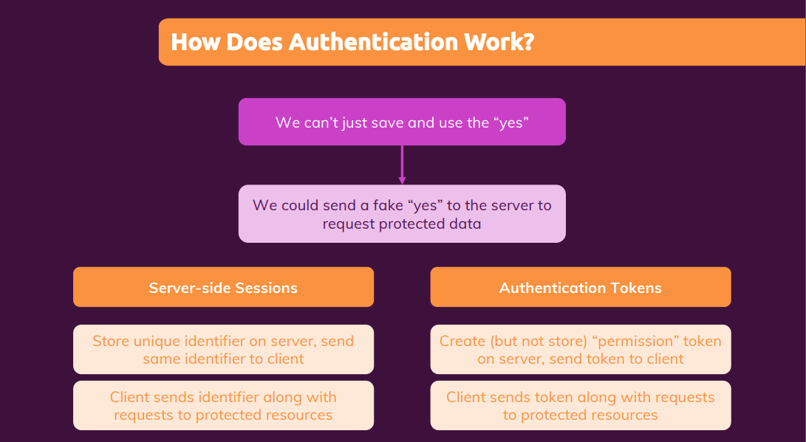
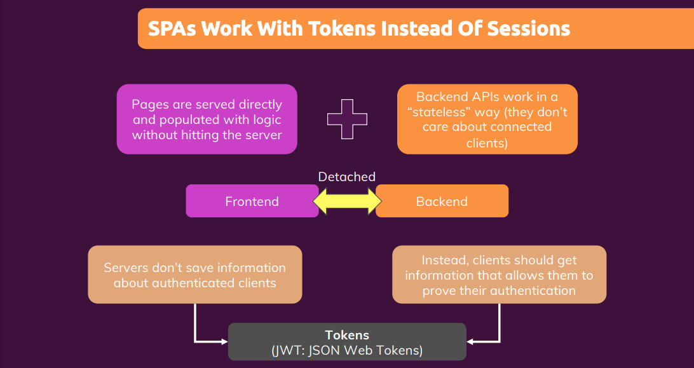
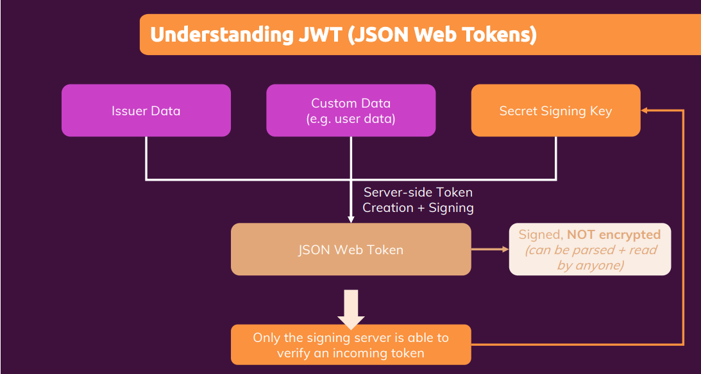

# Adding authentication

<p style="text-align: center; font-size: 20px; font-weight: bold; color: #e68a00"> Module Introduction </p>

- Module Content
  - How does authentication work?
  - Implementing Signup & Login
  - Controlling page access

<p style="text-align: center; font-size: 20px; font-weight: bold; color: #e68a00"> Our starting project </p>

- Created initial project setup

<p style="text-align: center; font-size: 20px; font-weight: bold; color: #e68a00"> How does Authentication work (In React & Next.js) Apps </p>



- If a request is sent to some backend API, that the old password should be replaced with a new one that kind of request
  should only be allowed and fulfilled if the user is authenticated. So that request which we send here needs some extra
  data attached to it, some extra data attached to the request which in the end tells the backend that this user is
  authenticated. Because anyone could be sending requests to our API.

  and hence the request needs to carry some extra permission which then should be verified on the server. And that
  permission part is important. Because a simple yes or no sent back by the server to the client would not be enough.
  Because we can of course always send a request to some API and point that requires authentication and say, "Hey, I'm
  authenticated." We can't just believe that as the author of the API we need some proof that a user is authenticated.
  And therefore authentication involves this exchange of credentials for permission. But the permission is more than
  just a yes or no.



- We can't just tell our server that we are authenticated and then request protected data or perform protected
  operations. And therefore, instead we need some proof. Some proof which can't be faked. And for this, we've got two
  main mechanisms.

  `Server-side sessions` and `authentication tokens`.

  Now these are two common approaches for solving this problem of unfakable permissions.

- The concept of server-side sessions works such that we store some unique identifier on a server. So we generate some
  session ID, which is unique. And we store that on the server, for example, in a database. And we send that same
  identifier to the client that send us the credentials.

  Then on the client, we can store that ID that identifier. And then we can use that stored identifier to attach it to
  requests which we there after are send to protected resources on the server. And then the server is always able to
  extract that identifier from the incoming requests check if it's stored that identifier in the database and if it did
  grant access, and if it does not deny access.

- The other concept is about authentication tokens. The idea here is that the server does not store any identifiers.
  Instead, the server creates and signs tokens. Which in the end are just a random strings. Random strings which can be
  unpacked to data packages so we take various pieces of data and sign them together. And then such a token is sent back
  to the client. The client can then save that token and again attach it to outgoing requests to tell the server that
  access should be granted. Now, even though the server does not store that token in a database or anywhere else the
  server knows how it's signed that token.



- Now when we build a single-page application. For one, pages are served directly and populated with logic without
  necessarily hitting the server. Of course, when working with Next.js, you can build pages which use getServerSideProps
  and therefore there will be a request handled by the server every time that page is being served.

  But you will also have many pages which are pre-generated. And once the user is on your website many pages won't be
  fetched from the backend at all but instead will be loaded and generated dynamically with front-end JavaScript because
  you still have a single-page application at least for many pages that make up your website after you initially loaded
  your first page then still JavaScript takes over, React takes over and handles your website.

- In addition, backend APIs which we used for a single-page applications are typically stateless. They don't care about
  the individual connected clients. They don't keep track of all the connected clients. Instead, the idea is that, that
  API can work pretty much on its own. And it just is able to hand out permissions to clients who authenticated so that
  they can then later request access to protect the resources. The API itself does not store any extra information
  about any connected clients.

  And since this is how we build single-page applications the server is not involved in every request and every action
  that's happening on our page because we handled that with front-end JavaScript and we have that stateless API
  connected to the SPA. And because of all of that, we could say that we have kind of a detached front-end and back-end
  combination.

  They do talk to each other sometimes but not for every action that's going on on the page. And because that's the
  case, servers don't save information about authenticated clients. And instead clients should get that standalone
  permission which allows them to prove that they are authenticated. And that's why we use these tokens.



- And here specifically, we use a concept called `JSON Web Tokens` that is simply the most common form of authentication
  token. And it's simply describes the way the token is generated. And in the end that JSON Web Tokens is generated with
  three main blocks. We got some issuer data. Some data which is automatically added into a token by the server when
  that token is generated. That's some metadata which we typically don't set up ourselves as a developer, but which is
  pre-configured by the third party packages we use for generating tokens. We can then still also add custom data to our
  token for example, some information about the user and then very important,

  we also set up a secret key. We set up that key on the server. The client never gets to see that key. And that's
  important because if you have that key you can create valid tokens, which are accepted by the server. Hence only the
  server knows that key. Then we generate a token with some third-party package by combining all these pieces together
  by creating a random string that incorporates all that data and is signed by that key. And that is that JSON Web Token,
  a long string.

  The important thing here is that signing does not mean encryption. The JSON Web Token is not encrypted. You can unpack
  it and read the data inside of it without knowing that key. That key only proves that a given server created that
  token.

- Now is that token which then is stored by the browser And which then is attached to requests to protected resources
  on the server. So to protected API routes. And for example, if you wanna change our password we don't just send the
  old and the new password but we also include that token in the outgoing request. And that token then is validated by
  the server.

- The great news is, that we don't need to build all these things from scratch but that instead for the token creation
  and validation and so on, we can rely on secure third-party packages.

<p style="text-align: center; font-size: 20px; font-weight: bold; color: #e68a00"> Using the "next-auth" library</p>

- we don't need to build everything from scratch. Instead there is a package, the NextAuth package which we can use for
  implementing authentication. Now the NextAuth package makes adding authentication to your next application super,
  super simple. And it actually supports a broad variety of authentication for writers. So you can't just go with your
  own email and password combination. You can also easily add Sign In with Google or Facebook or Apple or whatever you
  want with NextAuth.

  `npm install next-auth`

- NextAuth package has both server-side and client-side capabilities. We'll be able to use it on some API routes to
  verify if a user is logged in and we'll be able to use it in our components to do the same. Because of course the
  answer to the question whether a user is logged in and authenticated is not just needed on protected resources on the
  server-side, so in our API routes but also in our client-side components. There we also might want to show a different
  user interface based on whether a user is authenticated or not.

  And NextAuth will allow us to do both server-side and client-side validation. It will also help us with generating
  those Auth Tokens. Those JSON Web Tokens.

- One thing it will not do though is manage user creation for us. We need to bring our own logic for this. It does
  support various databases but mostly for other authentication methods. And when it comes to having our own user
  accounts then we need to bring our own signup API route and our own user verification logic.

<p style="text-align: center; font-size: 20px; font-weight: bold; color: #e68a00"> Adding a user signup API route</p>

- However, regarding the password, there is something we have to keep in mind and take care of. We should not store the
  plain password like this in the database, because if our database ever gets compromised by some employee or a third
  party intruder, then all our user credentials would be usable just like this. Hence for security reasons, it is a best
  practice and strongly recommended, that you don't store plain passwords in the database but that you instead encrypt
  them such that they can't be decrypted.

  and to encrypt passwords, we can install another third party package with `npm install bcryptjs`, like this.
  That's a package which helps us encrypt passwords or encrypt any kind of data of course, but we'll use it for a
  password here,

- call hash on that password, and the second argument then should be a number of salting rounds, which in the end will
  influence how strong that password is, and here a value of 12 is considered to be safe. The higher the number, the
  longer this function will take, the lower the number, the more insecure it is.

- Created api/auth/signup.js, lib/db.js, lib/auth.js

<p style="text-align: center; font-size: 20px; font-weight: bold; color: #e68a00"> Sending signup requests from the frontend </p>

- Refer auth-form.js

<p style="text-align: center; font-size: 20px; font-weight: bold; color: #e68a00"> Improving signup with unique email addresses </p>

- Now creating users works, but at the moment, we can create the same user, with the same email address, multiple times.
  And that's typically not what we want to do. Therefore, to avoid that we do that, in our signup handler function here,
  we should check if a user for a given email already exists. So once we connected here to the database, before we hash
  the password and store the user, I want to check if a user already exists.

  I want to get a existing user by using db.collection('users') and calling find there, or findOne to be precise.
  FindOne allows us to find one document, and we pass a object to findOne where we describe how to search for that
  document. Key value pairs here.

- Refer /api/auth/signup.js

<p style="text-align: center; font-size: 20px; font-weight: bold; color: #e68a00"> Adding the "credential Auth 
Provider" & user login logic </p>

- Now that we are able to create users, it's now time to work on the authentication functionality. So on logging users in
  and getting that permission, this token for our logged in users. And being able to find out if a user is logged in,
  both on the client side for changing what we see and for disabling certain routes, as well as on the server side in
  different API routes we might be adding.

- And that's now the part where this NextAuth package, which we installed earlier already becomes important. It helps us
  with authenticating users and it helps us with finding out whether a user has that permission by managing that token
  creation and storage, both parts behind the scenes.

- Now, to use NextAuth, we start by adding another API route because logging a user in, signing a user in, that, of  
  course, also requires a request to be sent to a certain API route where we then look into the database and find out
  whether we have that user in the database and whether the password is correct.

- And therefore, I'll create another file in that api/auth folder but this file now needs a special name. It's a square
  bracket file name. So a dynamic API route and it's a dynamic catch all API route, which catches all unknown routes
  that start with api/auth. Here we can then use ...nextauth written like this. One word and in here, we now use that
  NextAuth package. And we need this catch all route because the next auth package behind the scenes will expose
  multiple routes for user login and for user logout, for example. And therefore, I'll create another file in that api/
  auth folder but this file now needs a special name. It's a square bracket file name. So a dynamic API route and it's a
  dynamic catch all API route, which catches all unknown routes that start with api/auth. Here we can then use
  [...nextauth] written like this.

  And we need this catch all route because the next-auth package behind the scenes will expose multiple routes for user
  login and for user logout, for example.

- So NextAuth here is a function, which we can execute and when we execute it, it returns a new function, a handler
  function. It needs to because this is still an API route and therefore, an API route still needs to return a function.
  It needs to export a function.

- But here, we need the Credentials provider, which means that we bring our own credentials. Now, this takes a
  configuration object itself and here, we now can configure a couple of things. For example, we can set the credentials
  key and then here define what our credentials are. Email and password. We could use that to let NextAuth generate a
  login form for us. Here, however, I don't wanna let NextAuth generate a form for me. I already have one and hence,
  I'll not set credentials.

- The only thing we need to set here actually is authorize and authorize turns out to be a method. It's a method which
  Next.js will call for us when it receives a incoming login request. Authorize is an async function, so it returns a
  promise, and as a argument, we get the credentials that were submitted. And that is the object with the data we
  submitted, for example, email, password. In here, we now have to bring our own authorization logic, check if the
  credentials are valid and tell the user if that's not the case.

- bcrypt.js has a method that helps us in validating password. It has the compare function. And that allows us to find
  out if a plaintext password matches a hashedPassword. So if that plaintext password could result in the same
  hashedPassword

- To make sure that a JSON Web Token is created, we should go to the NextAuth config object and besides setting up our
  providers, also add the session option here.

- Refer [...nextuth].js and lib/auth.js

<p style="text-align: center; font-size: 20px; font-weight: bold; color: #e68a00"> Sending a "Singin" request from the 
frontend </p>

- To send Singin request from the frontend we import "signIn" from NextAuth That's a function which we can call in our
  component to send a signIn request. And the request will be sent automatically.

  ```js
  import { signIn } from "next-auth/client";

  if (isLogin) {
    const result = await signIn("credentials", {
      redirect: false,
      email: enteredEmail,
      password: enteredPassword,
    });

    console.log(result);
  }
  ```

- Refer auth-form.js

<p style="text-align: center; font-size: 20px; font-weight: bold; color: #e68a00"> Managing active Session (On the Frontend) </p>

- I wanna make sure that the options in the header change based on whether we are authenticated or not. And again,
  Next.js makes that pretty easy for us. It is worth noting that after we locked in successfully, Next.js added a cookie.
  In Appliatin tab, we see some cookies that were set and these are cookies which are generated and managed by Next.js.

  For example this session token is this json web token in the end. That was set automatically by Next.js when we logged
  in successfully. And it will also use that token automatically for us, when we try to change what we see on the screen,
  or when we try to send requests to protected resources. For example we can get the answer to whether the user is
  logged in or not, by finding out whether it's such a valid token exists.

- if the user using this page at the moment is authenticated or not, Next.js gives us a convenient way of doing that
  which is useSession. It will return an array with exactly two elements. It is an array where the first element is the
  session object describing the act of session, and the second element is loading which tells us wherever Next.js is
  currently still figuring out whether we are logged in or not.

  ```js
  import { useSession } from "next-auth/client";

  const [session, loading] = useSession();
  {
    !session && !loading && (
      <li>
        <Link href="/auth">Login</Link>
      </li>
    );
  }
  ```

- Refer main-navigation.js

<p style="text-align: center; font-size: 20px; font-weight: bold; color: #e68a00"> Adding user logout</p>

- We use signOut() from next-auth to logout And that, now, all returns a promise, which tells us when it's done. But
  here I don't even care about that because since I'm using useSession this component will be updated automatically
  anyways, as soon as the active session changes. And it will change when we sign out. Next.js will then clear that
  cookie and clear that information that the active user is logged in.

  ```js
  import { signOut, useSession } from "next-auth/client";
  function logoutHandler() {
    signOut();
  }
  ```

- Refer main-navigation.js

<p style="text-align: center; font-size: 20px; font-weight: bold; color: #e68a00"> Adding client-side page guards (Route protection)</p>

- So of course, if we are not logged in we shouldn't be able to visit this profile page. And if we were on that page and
  we click logout we should be redirected. and implementing that is straight forward with next auth.

- At the moment useSession returns session and loading but there is this scenario that if you load a page, loading stays
  true and it doesn't really update. At least at the moment useSession returns session and loading but there is this
  scenario that if you load a page, loading stays true and it doesn't really update.

- Besides useSession, there also is getSession. And the difference is that with useSession we immediately get this
  session and loading thing here, and then both session and loading could change if session data was fetched. If we have
  no session because we're logged out session will never change though and as we see loading unfortunately also doesn't
  change It stays true.

- getSession works differently. getSessions, sends a new request and gets the latest session data and we can then react
  to the response for that request. And that allows us to manage our own loading state while for getting the
  session and act accordingly.

- Below code can be added to profile page or UserProfile component.

  ```js
  const [isLoading, setIsLoading] = useState(true);

  useEffect(() => {
    getSession().then((session) => {
      if (!session) {
        window.location.href = "/auth";
      } else {
        setIsLoading(false);
      }
    });
  }, []);

  if (isLoading) {
    return <p>Loading...</p>;
  }
  ```

- Refer user-profile.js

<p style="text-align: center; font-size: 20px; font-weight: bold; color: #e68a00">Adding Server-Side Page Guards (And when to use which apporach)</p>

- So, we are now protecting that profile page and we redirect away for not authenticated. But that brief moment of
  loading, which flashes on the screen when we enter profile when not authenticated that is maybe something we want to
  get rid of.

  Now, we can't really get rid of it with just client side code, because if we visit this page and we then use client
  side JavaScript code to determine whether we are authenticated or not, then we'll always need to wait that fraction of
  a second to find out if we are. But we must not forget that Next.js blends server side and client side code, so we can
  use server side code to determine whether the user, who sent the request, is authenticated or not and return different
  page content and possibly a redirect if the user is not authenticated.

- In profile page, We could, of course, add the getStaticProps function here. This would allow us to fetch data for this
  page in advance. But that's the wrong function, why? Because you must not forget that getStaticProps runs during build
  time. Yes, it can also run thereafter with revalidate set to a certain duration, but it mainly runs during build time.
  It does absolutely not run for every incoming request. Now here, in this case, every incoming request matters though
  because we need to find out, if that user is logged in or not.

  And that's why instead we should use getServiceSideProps that will then get a context object where we get access to
  the incoming request.

- And the good thing about getSession,you're not limited to using it on client side code only. But you can also use
  getSession on the server side, even though it's imported from next-auth/client. And then, getSession will
  automatically look into that request and extract the data it needs the session token cookie, to be precise, and see if
  that's valid, and if the user is authenticated and if that cookie even exists to begin with. So, that will all happen
  behind the scenes. And this will be null if the user is not authenticated and it will be a valid session object, if
  the user is authenticated.

  ```js
  export async function getServerSideProps(context) {
    const session = await getSession({ req: context.req });

    if (!session) {
      return {
        redirect: {
          destination: "/auth",
          permanent: false,
        },
      };
    }

    return {
      props: { session },
    };
  }
  ```

- Refer profile.js

<p style="text-align: center; font-size: 20px; font-weight: bold; color: #e68a00">Protecting the "Auth" Page</p>
- If signing in succeeded, and that is when we want to redirect. Now we could again redirect with window.location.ref,
  but that basically resets the entire application. That is fine for an initial page load but if we already worked in 
  this application, and we have the single-page application already going on, then we probably don't wanna reset the 
  entire application and lose all our state. So we can import from 'next/router,' and from there we can import the 
  useRouter hook.

- Refer auth.js page

<p style="text-align: center; font-size: 20px; font-weight: bold; color: #e68a00">Using the "next-auth" Session Provider 
component </p>

- At the moment, we're using this session functionality in a couple of different components. To be precise we use use
  session in the Main Navigation component. Now, one problem we have with that is that if we are authenticated and I
  reload whilst on this profile page then we figure out whether the user is authenticated or not in that getServiceSideProps function of that page, here, this function runs, and then after the page was loaded, does useSession hook which we use and Main Navigation.

- And we see this here in the Network tab. If I reload, you see there is a request being sent to /api/auth/session.
  That request is actually sent by that useSession hook. And it's sent to check Whether that session cookie which had
  found is valid, because we can't validate that with client site JavaScript for security reasons. Hence that cookie
  needs to be sent to an end point which then determines whether it is valid or not.

  So that's why this request is being sent. There is nothing wrong with this request, but since we already checked our
  session here in getServerSideProps. when we loaded /profile we already know that we are authenticated. So this is
  actually a redundant request which is being sent here. And we can avoid it, by using a extra component offered by
  next-auth.

- In most cases, this will be undefined because most pages don't have this Prop but our profile page, for example, does
  have it. And then the session is already set to this already loaded session. And that then allows next-auth to skip
  the extra session check performed by use session. If we already have the session from our getServeSideProp function.

  Now, if we loaded another component, where does this not set session is on the find and use session We'll still do its
  thing and check it manually. But in cases where we already know that there is a session we can save some performance
  and a wide some redundant HTTP requests.

- Nonetheless, using this Provider wrapper, is a recommended pattern because it theoretically or practically allows
  next-auth to optimize itself internally, and skip certain checks and possibly HTTP requests.

  ```js
  function MyApp({ Component, pageProps }) {
    return (
      <Provider session={pageProps.session}>
        <Layout>
          <Component {...pageProps} />
        </Layout>
      </Provider>
    );
  }
  ```

<p style="text-align: center; font-size: 20px; font-weight: bold; color: #e68a00">Analyzing further authentication requirements </p>

- If you're building an online shop, you might only want to allow logged in users, to create and delete and manage
  products. And in the interface which your website has for managing those products, you would be sending requests
  behind the scenes, to certain API end points, certain API routes. Where those requests then trigger certain operations.
  Like the creation of a product or the deletion of a product.

  And of course you want to make sure that, those requests only trigger those operations, if they come from
  authenticated users. So that if you have API routes in your project, API routes that do certain operations that are
  only allowed for authenticated users, that in those API routes you also verify, whether that request is coming from an
  authenticated user or not.

- Because even if you have full control over this user interface, requests to APIs can also be sent with other tools.
  From the command line, with tools like Postman which allows you to create http requests. So there are ways of sending
  requests to APIs, that don't require your website. And therefore protecting the pages on those websites, is one thing
  but we also need protection in those API routes. Where we validate incoming requests, and double check that this
  request is coming from an authenticated source.

<p style="text-align: center; font-size: 20px; font-weight: bold; color: #e68a00">Protecting API routes</p>

- For changing the password, a POST, or a PUT, or a PATCH request makes sense. These are the three kinds of requests
  that imply that resources on the server should be created or changed, and you can argue whether changing a password
  is creating a new resource, a new password, or changing an existing resource and existing user,

- Check no 1: and I want to say that I only want to continue here, if the incoming request has a method of PATCH. So if
  it's not PATCH, then we will just return and not continue at all.

- Check no 2: whether that request is coming from an authenticated user or not, and if it's not, we also want to return
  with an error, and for this we will use getSession(). getSession needs that incoming request, because it will then
  look into that request, see if a session token cookie is part of the request. If it is, it will validate and extract
  that data from that cookie, and if that all then makes sense, it will give us the session object.

  ```js
  async function handler(req, res) {
    if (req.method !== "PATCH") {
      return;
    }

    const session = await getSession({ req: req });

    if (!session) {
      res.status(401).json({ message: "Not authenticated!" });
      return;
    }
  }
  ```

- Refer change-password.js

<p style="text-align: center; font-size: 20px; font-weight: bold; color: #e68a00">Adding the "Change password" Logic</p>

- Refer change-password.js

<p style="text-align: center; font-size: 20px; font-weight: bold; color: #e68a00">Sending a "Change Password" request from the frontend</p>

- Refer profile-form.js, user-profile.js

<p style="text-align: center; font-size: 20px; font-weight: bold; color: #e68a00">Module Summary & Final steps</p>

- Now it is worth noting that there are more providers than the Credentials provider we used. This is the provider where
  you manage your own users with email, password, or whatever your credentials are. You can also use a third party
  provider like Apple or Amazon or GitHub or Facebook. All of that is possible as well. You can bring those providers as
  well, and if you want to add this kind of authentication to your application, simply check out the NextAuth Docs for
  that provider you want to use.

- Providers in this NextAuth file which you always need, providers is an array, so you can always add multiple providers
  to your application so that you can offer multiple log in alternatives to your users. So NextAuth is very powerful and
  flexible.
