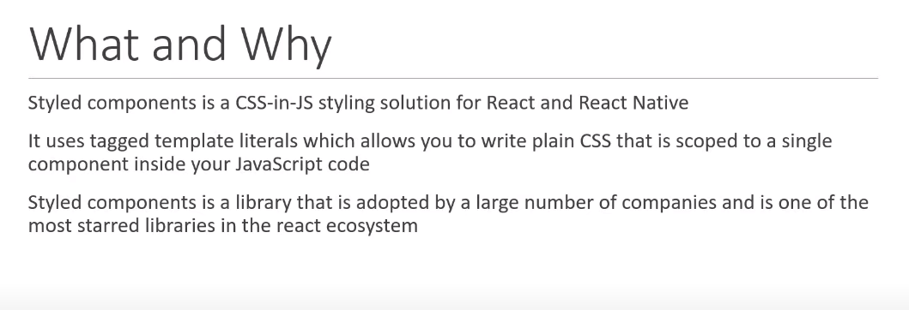

# React Styled Components

<p style="text-align: center; font-size: 20px; font-weight: bold; color: #e68a00"> What and Why?</p>

- 

<p style="text-align: center; font-size: 20px; font-weight: bold; color: #e68a00"> Features / Benefits</p>

---

- 

- ## Automatic Critical CSS :

  The library automatically keeps track of which components are rendered on the screen and injects only their styles
  combine it with code splitting and you're loading the least amount of code necessary.

- ## No Class name Bugs :

  The second benefit is no class name bugs the library generates unique class names for every style you never have to
  worry about duplication overlap or misspellings.

- ## Easier deletion of css :

  If you worked on a large codebase which makes use of plain css files it becomes very tricky to keep track of unused
  classes with styled components every style is tied to a specific component if a component is unused which is easily
  pointed out in vs code deleting the component will delete its styles as well.

- ## Dynamic Styling :

  In react where props drive components sometimes. styles also need to be adapted based on props, styled components
  library makes this really simple.

- ## Painless Maintenance :

  It is very easy to organize styles with this library and you don't have to move across different files to find the style affecting your component

- ## Automatic vendor prefixing :
  For some of the newer css features you might have to explicitly write the css property for each browser with style components though you can write your css to the current standard and the library will handle the rest.

<p style="text-align: center; font-size: 20px; font-weight: bold; color: #e68a00"> Installation and Setup </p>

---

- Create a react app: npx create-react-app styled-components-demo

  Install styled component : yarn add styled-components

- Basic Styled Components

  Step - 1:
  import styled from "styled-components";

  Step - 2:
  export const StyledButton = styled.button` // add styles`;

<p style="text-align: center; font-size: 20px; font-weight: bold; color: #e68a00"> Using Props </p>

---

```js
export const StyledButton = styled.button`
  border: 2px solid #4caf50;
  background-color: ${(props) =>
    props.variant === "outline" ? "#FFF" : "#4caf50"};
  color: ${(props) => (props.variant === "outline" ? "#4caf50" : "#FFF")};
  padding: 15px 32px;
  text-align: center;
  text-decoration: none;
  display: inline-block;
  font-size: 16px;
  cursor: pointer;
  transition: 0ms.5s all ease-out;
`;
```

<p style="text-align: center; font-size: 20px; font-weight: bold; color: #e68a00"> Extending Styles </p>

---

```js
export const FancyButton = styled(StyledButton)`
  background-image: linear-gradient(to right, #f6d365 0%, #fda085 100%);
  border: none;
`;
```

- Another cool feature that styled components library offers is the ability to provide a polymorphic prop

  ```js
  <FancyButton as="a">Fancy Button</FancyButton>
  ```

- If props are passed to extended style then this props are passed to StyledButton as well.

  ```js
  <FancyButton as="a" variant="outline">
    Fancy Button
  </FancyButton>
  ```

<p style="text-align: center; font-size: 20px; font-weight: bold; color: #e68a00"> Pseudo classes </p>

---

- Now hover is just one of the many pseudo classes available you can style the :active state, :focus state , :checked
  state or even pseudo elements like ::before, ::after, ::firstline first letter etc.

  ```js
    &:hover {
        background-color: ${(props) =>
          props.variant !== "outline" ? "#FFF" : "#4caf50"};
        color: ${(props) => (props.variant !== "outline" ? "#4caf50" : "#FFF")};
      }
  ```

<p style="text-align: center; font-size: 20px; font-weight: bold; color: #e68a00"> Passed Props and Adding Attributes </p>

---

- Styled components gives you the option to specify attributes once and avoid duplication when invoking the same
  component in multiple places

  ```js
  export const SubmitButton = styled(StyledButton).attrs({
    type: "submit",
  })`
    box-shadow: 0 9px #999;
    &:active {
      background-color: ${(props) =>
        props.variant !== "outline" ? "#FFF" : "#4caf50"};
    }
  `;
  ```

- Attribute constructor also accepts a function which receives the component props as argument so props are a function
  and it returns an object.

  ```js
  export const SubmitButton = styled(StyledButton).attrs((props) => ({
    type: "submit",
  }))`
    box-shadow: 0 9px #999;
    &:active {
      background-color: ${(props) =>
        props.variant !== "outline" ? "#FFF" : "#4caf50"};
    }
  `;
  ``;
  ```

<p style="text-align: center; font-size: 20px; font-weight: bold; color: #e68a00"> Animations </p>

---

```js
const rotate = keyframes`
	  from {
	    transform: rotate(0deg);
	  }
	  to {
	    transform: rotate(360deg);
	  }
	`;

export const AnimatedLogo = styled.img`
  height: 40vmin;
  pointer-events: none;
  animation: ${rotate} infinite 20s linear;
`;
```

<p style="text-align: center; font-size: 20px; font-weight: bold; color: #e68a00"> Theming </p>

---

- Styled components has full theming support by exporting a ThemeProvider wrapper component

  ```js
  const theme = {
    dark: {
      primary: "#000",
      text: "#fff",
    },
    light: {
      primary: "#fff",
      text: "#000",
    },
  };

  <ThemeProvider theme={theme}>
    <DarkButton>Dark Theme</DarkButton>
  </ThemeProvider>;

  export const DarkButton = styled(StyledButton)`
    border: ${(props) => props.theme.dark.primary};
    background-color: ${(props) => props.theme.dark.primary};
    color: ${(props) => props.theme.dark.text};
  `;
  ```

- What you have to know about the theme provider is that it provides this theme to all react components underneath
  itself via the context api so all the style components will have access to this provided theme even when there are
  multiple levels deep.

<p style="text-align: center; font-size: 20px; font-weight: bold; color: #e68a00"> Global Styles </p>

---

- Normally style components are automatically scoped to a local css class and therefore isolated from other components.
  Things like css resets or base style-sheets however need to be applied globally. To help with this the library provides
  a helper function called `createGlobalStyle`

  ```js
  const GlobalStyle = createGlobalStyle`
  botton {
    /* font-family: 'Roboto'; */
    font-family: ${(props) => props.theme.fontFamily};
  }
  `;
  ```

- Refer App.js
