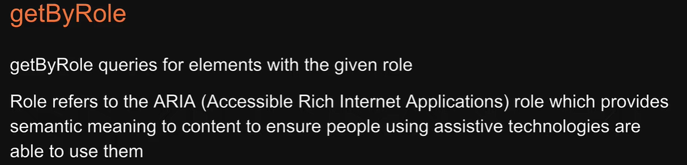
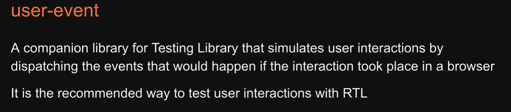

# React testing

---

<p style="text-align: center; font-size: 20px; font-weight: bold; color: #e68a00"> Introduction </p>


---

<p style="text-align: center; font-size: 20px; font-weight: bold; color: #e68a00"> Project Setup </p>

- Create a rect app with typescript : `npx create-react-app <appname> --template typescript`
- The best part of `create-react-app` is it also includes jest and react testng library with useful default.

---

<p style="text-align: center; font-size: 20px; font-weight: bold; color: #e68a00"> Running tests </p>

- It also provides a sample test asn script to run tests in the project.

- In package.json, A test script is added for us. This will run the command `react scripts` followed by test which will internally call jest.

- npm test or yarn test : this will start a watch mode.


- when we run that script jest finds test executes it and prints the result which is pass in our case

---

<p style="text-align: center; font-size: 20px; font-weight: bold; color: #e68a00"> Anatomy of a test </p>

- now all you need in a test file is the test() method which runs a test


- The second argument is a function that contains the expectation to test, this is where react testing library comes
  into picture we begin by creating a virtual dom of the app component using the render method from react testing library
  import render app component and pass app component as an argument to render next we use screen from react testing
  library which is an object that contains methods to query the virtual dom.

  In this example we use a query called getByText, it accepts a string or irregular expression as its argument in this
  example we use a case insensitive regex with the words learn react

- Neither test nor expect have been imported how is this code working well this is another nice feature that  
  create-react-app has provided for us both test and expect are methods from jest which create react app globally
  provides in every test you as a developer don't have to import it.

- As you can see we use a combination of jhest and react testing library this is the anatomy of a test in a react project

- Every test begins with the test method from jest the first argument is the name of the test the second argument is a
  function which contains the expectations to test we use react testing library to create a virtual dom and get hold of
  the element against which we need to assert we then use the expect method from jest along with to be in the document
  which is called a matcher function to carry out the assertion if this expectation succeeds we see pass in the terminal.

---

<p style="text-align: center; font-size: 20px; font-weight: bold; color: #e68a00"> Your First test </p>

- Create a component folder inside src, then create a greet folder, then create greet.tsx and
  create a test file greet.test.tsx

  

  ```js
  import { render, screen } from "@testing-library/react";
  import Greet from "./greet";

  test("Greet renders correctly", () => {
    // Arrange
    render(<Greet />);

    // Act
    // ... nothing (for now)

    // Assert
    const textElement = screen.getByText(/hello/i);
    expect(textElement).toBeInTheDocument();
  });
  ```

---

<p style="text-align: center; font-size: 20px; font-weight: bold; color: #e68a00"> Test driven development </p>

  

- Test First

  ```ts
  test("Greet renders correctly", () => {
    render(<Greet />);

    const textElement = screen.getByText(/hello/i);
    expect(textElement).toBeInTheDocument();
  });

  test("Greet renders with a name", () => {
    render(<Greet name="Jitendra" />);

    const textElement = screen.getByText(/hello jitendra/i);
    expect(textElement).toBeInTheDocument();
  });
  ```

- Then code

  ```ts
  type Greetprops = {
    name?: string;
  };

  export const Greet = (props: Greetprops) => {
    return <div>Hello {props.name}</div>;
  };
  ```

---

<p style="text-align: center; font-size: 20px; font-weight: bold; color: #e68a00"> Jest watch mode </p>

  

---

<p style="text-align: center; font-size: 20px; font-weight: bold; color: #e68a00"> Filtering tests </p>
  

- On the global test method you can use .only so test.only in which case jest will pick up only that test to run. you
  can see only that test is run and the other test is skipped using .only() is quite common when you're working on a
  test in a file that contains multiple tests

  ```ts
  test.only("renders learn react link", () => {
    render(<App />);
    const linkElement = screen.getByText(/learn react/i);
    expect(linkElement).toBeInTheDocument();
  });
  ```

- similar to .only() you can also use .skip() in this case jest will skip executing that test

  ```ts
  test.skip("renders learn react link", () => {
    render(<App />);
    const linkElement = screen.getByText(/learn react/i);
    expect(linkElement).toBeInTheDocument();
  });
  ```

---

<p style="text-align: center; font-size: 20px; font-weight: bold; color: #e68a00"> Grouping tests </p>

- If you prefer your tests to be grouped then you can use global describe() method.

    

  ```ts
  describe("Greet", () => {
    test("Greet renders correctly", () => {
      render(<Greet />);

      const textElement = screen.getByText(/hello/i);
      expect(textElement).toBeInTheDocument();
    });

    test("Greet renders with a name", () => {
      render(<Greet name="Jitendra" />);

      const textElement = screen.getByText(/hello jitendra/i);
      expect(textElement).toBeInTheDocument();
    });
  });
  ```

- We can use .only and .skip on describe as well.

- It is possible to write nested describe.

  ```ts
  describe("Greet", () => {
    test("renders correctly", () => {
      render(<Greet />);

      const textElement = screen.getByText(/hello/i);
      expect(textElement).toBeInTheDocument();
    });

    describe("Nested", () => {
      test("renders with a name", () => {
        render(<Greet name="Jitendra" />);

        const textElement = screen.getByText(/hello jitendra/i);
        expect(textElement).toBeInTheDocument();
      });
    });
  });
  ```

- It is possible to add multiple describe block in single file.

- According to jest folks, test suites corresponds to a file, not individual describe block.

---

<p style="text-align: center; font-size: 20px; font-weight: bold; color: #e68a00"> Filename conventations </p>

- Up until now we have created our tests in a `.test.tsx` file as it turns out we are not restricted to just that
  file name convention. With create-react-app, jest will look for test files with any of the following popular naming
  conventions.

  

- An alternative to the test() method with jest you can either use test or it() global methods

  And if you want to replicate test.only() you can use fit()

  To replicate test.skip() you can use xit() to temporarily exclude the test from being executed

---

<p style="text-align: center; font-size: 20px; font-weight: bold; color: #e68a00"> Code coverage </p>

  

- now what is great about create-react-app and jest is that with zero configuration you can request test coverage
  information to be collected and reported in the output

- How to obtain code coverage?

  `npm run test:coverage`

  We can add this in package.json

  ```js
   "scripts": {
    "start": "react-scripts start",
    "build": "react-scripts build",
    "test": "react-scripts test",
    "eject": "react-scripts eject",
    "test:coverage": "react-scripts test --env=jsdom --watchAll=false --coverage"
  }
  ```

  and the reason we do that is because coverage generally takes time and you don't want that as part of your regular
  test script.

- Test coverage can be collected from specified files as all other files won't be required.
  `--collectCoverageFrom='src/components/**/*.{ts,tsx}'`

  ```js
  "scripts": {
    "start": "react-scripts start",
    "build": "react-scripts build",
    "test": "react-scripts test",
    "eject": "react-scripts eject",
    "test:coverage": "react-scripts test --env=jsdom --watchAll=false --coverage --collectCoverageFrom='src/components/**/*.{ts,tsx}'"
  }
  ```

- When dealing with larger applications you're bound to have files that don't need a test. So we can exclude them from
  test coverage report by adding -

  ```js
  --collectCoverageFrom='!src/components/**/*.{types,stories,constants,test,spec}.{ts,tsx}'
  ```

- with jest it is possible to specify a minimum threshold enforcement for coverage reports if thresholds aren't met  
  jhest will fail.

  ```js
  "jest": {
    "coverageThreshold": {
      "global": {
        "branches": 80,
        "functions": 80,
        "lines": 80,
        "statements": -10
      }
    }
  }
  ```

- jest also generates an html file of your coverage report and the coverage folder in the coverage report folder there is
  an index.html if you open that file you see the same report but with some css applied if you select the file it also
  highlights the uncovered branch.

  with that being said it is generally accepted that 80 percent coverage is a good goal to aim for and you should make
  code coverage part of your continuous integration pipeline.

---

<p style="text-align: center; font-size: 20px; font-weight: bold; color: #e68a00"> Assertions </p>

  

  

- we have used there toBeInTheDocument() matcher but we don't see that in our list here and that is because jest out of
  the box provides matcher functions for javascript testing that does not involve a ui or the dom so what we do is
  extend the list of jest matchers by adding an additional package called jest dom.

  jest-dom is installed for us with create-react-app setup

- Now setupTests.ts is something we will come across later on in the series but all you have to know is that it is a
  global setup file in a create-react-app project and this file will be automatically executed before just runs a test
  that is the reason to be in the document is available for us in our test file.

---

<p style="text-align: center; font-size: 20px; font-weight: bold; color: #e68a00"> What to test? </p>

  

  

---

<p style="text-align: center; font-size: 20px; font-weight: bold; color: #e68a00"> RTL Queries </p>

  

  

  

---

<p style="text-align: center; font-size: 20px; font-weight: bold; color: #e68a00"> getByRole </p>

  

  

- Refer application/application.tsx and application.test.tsx

- To find out corresponding roles visit - https://www.w3.org/TR/html-aria/

---

<p style="text-align: center; font-size: 20px; font-weight: bold; color: #e68a00"> getByRole options </p>

  
  
- How do we resolve this issue where we have multiple elements that have the same role. get by role will throw an error
  if it finds multiple elements with the given role. well this is where our first option comes into picture and that is the name option.

```ts
const nameElement = screen.getByRole("textbox", {
  name: "Name",
});
```

- We want to ensure that the two heading elements are of different levels we want to make sure the page heading is an h1
  element and the section heading is an h2 element to address this concern react testing library provides us with a level option that is specific to the heading role so instead of using name for page heading we're going to specify
  level 1 and for the section heading level 2 here level corresponds to h1 and h2 and can go all the way till a value of 6.

  

  ```ts
  const pageHeading = screen.getByRole("heading", {
    level: 1,
  });
  expect(pageHeading).toBeInTheDocument();

  const sectionHeading = screen.getByRole("heading", {
    level: 2,
  });
  expect(sectionHeading).toBeInTheDocument();
  ```

- getByRoll() method should be your top preference for just above everything if for some reason it doesn't work well
  with your component code you can make use of one of the other queries.

---

<p style="text-align: center; font-size: 20px; font-weight: bold; color: #e68a00"> getByLabelText </p>

---

<p style="text-align: center; font-size: 20px; font-weight: bold; color: #e68a00"> getByplaceholderText </p>

---

<p style="text-align: center; font-size: 20px; font-weight: bold; color: #e68a00"> getByText </p>

---

<p style="text-align: center; font-size: 20px; font-weight: bold; color: #e68a00"> getByDisplayValue </p>

---

<p style="text-align: center; font-size: 20px; font-weight: bold; color: #e68a00"> getByAltText </p>

---

<p style="text-align: center; font-size: 20px; font-weight: bold; color: #e68a00"> getByTitle </p>

---

<p style="text-align: center; font-size: 20px; font-weight: bold; color: #e68a00"> getByTestId </p>

---

<p style="text-align: center; font-size: 20px; font-weight: bold; color: #e68a00"> Priority order for quries </p>

---

<p style="text-align: center; font-size: 20px; font-weight: bold; color: #e68a00"> Query multiple elements </p>

---

<p style="text-align: center; font-size: 20px; font-weight: bold; color: #e68a00"> textMatch </p>

---

<p style="text-align: center; font-size: 20px; font-weight: bold; color: #e68a00"> queryBy </p>

---

<p style="text-align: center; font-size: 20px; font-weight: bold; color: #e68a00"> findBy </p>

---

<p style="text-align: center; font-size: 20px; font-weight: bold; color: #e68a00"> Manual Queries </p>

---

<p style="text-align: center; font-size: 20px; font-weight: bold; color: #e68a00"> Debugging </p>

- screen.debug();

---

<p style="text-align: center; font-size: 20px; font-weight: bold; color: #e68a00"> Testing Playground </p>

- Install getByRole() extension in browser. Go to react app. Select inspect pointer and then hover over the elements.
  Testing playground will give you the best quries for that articular element. You can then copy and use them.

---

<p style="text-align: center; font-size: 20px; font-weight: bold; color: #e68a00"> User interations </p>

- To test user interactions we are going to be using a library called user-event

  

  

  

- Now the great about create-react-app is that the user event library is installed by default.

---

<p style="text-align: center; font-size: 20px; font-weight: bold; color: #e68a00"> Pointer interations </p>

---

<p style="text-align: center; font-size: 20px; font-weight: bold; color: #e68a00"> Keyboard interations </p>

---

<p style="text-align: center; font-size: 20px; font-weight: bold; color: #e68a00"> Providers </p>

- we see that the test fails expected element to have text content dark mode but received light mode now why is this
  happening well this is because our individual MuiMode component in our test environment does not have AppProviders as
  the wrapper component AppProviders is present in app.tsx but we are not rendering app.tsx we are rendering only
  MuiMode so how do we test this component that is wrapped in a provider well react testing library provides a wrapper
  option when rendering so on the render function add a second argument which is an object here specify a property
  called wrapper and set it to app providers.

  ```ts
  describe("MuiMode", () => {
    test("renders text correctly", () => {
      render(<MuiMode />, {
        wrapper: AppProviders,
      });
      const headingElement = screen.getByRole("heading");
      expect(headingElement).toHaveTextContent("dark mode");
    });
  });
  ```

- if you think about it in a practical application we want almost every component to be wrapped with the theme provider
  which means something like app providers is necessary for every test you write in your app wouldn't it be nice if
  there was a way to specify the wrapper option once for every test in the app.

---

<p style="text-align: center; font-size: 20px; font-weight: bold; color: #e68a00"> Custom Render Functions </p>

- For something like theme provider orredux store provider it makes sense to have the wrapper at the top level and
  available for every component. This will save us from having to specify the wrapper option in every test.

  Now the way to achieve a single wrapper across all tests is by writing a custom render function.

- Head over to https://testing-library.com/docs/react-testing-library/setup and Go to Custom Render and copy the code.
  Refer src/test-utils.tsx

---

<p style="text-align: center; font-size: 20px; font-weight: bold; color: #e68a00"> Custom React Hooks </p>

- When we pass useCounter() to rnder, typescript throws an error argument of type custom hook is not assignable to
  parameter of type react element now this is because unlike a react component a custom hook does not return any jsx
  also a hook cannot be called outside a function component so we cannot just ignore render and invoke use counter for
  our testing.

- Well if this is the case how do we test a custom hug well to help us with that react testing library provides a render
  hook function so at the top instead of importing render import render hook in the test call renderHook() passing in
  useCounter(), what you should also know is that unlike a regular component which can be asserted using screen hooks do
  not have any dom elements instead render hook will wrap the hook in a function component invoke the hook and returns
  an object from which we can destructure a property called result.

  ```ts
  import { renderHook } from "@testing-library/react";
  import { useCounter } from "./useCounter";

  describe("useCounter", () => {
    test("should render the initial count", () => {
      const { result } = renderHook(useCounter);
      expect(result.current.count).toBe(0);
    });
  });
  ```

- Refer hooks/use-counter/useCounter.test.tsx

---

<p style="text-align: center; font-size: 20px; font-weight: bold; color: #e68a00"> Act Utiliy </p>

- When we update the state in test, we get error related to act(). To know more visit "react docs act()"

  act is a function that ensures updates are processed before assertions are made.

  ```js
  test("should increment the count", () => {
    const { result } = renderHook(useCounter);
    act(() => result.current.increment());
    expect(result.current.count).toBe(1);
  });
  ```

- When testing custom hooks, more specifically code that causes state updates react testing library cannot wrap them
  with the act utility function we have to manually import it and wrap code that causes state updates for the most part
  react testing library wraps every method it exposes within act having to manually import and use it is a one-off
  scenario.

---

<p style="text-align: center; font-size: 20px; font-weight: bold; color: #e68a00"> Mocking functions </p>

- While rendering CounterTwo, we need to pass handler function as well if we want to test button click event. But what
  function to pass from test. Well, jest mock function helps us here.

  mock functions allow you to test your code without having to worry about the actual implementation of a function.

  ```ts
  test("handlers are called", async () => {
    const incrementHandler = jest.fn();
    const decrementHandler = jest.fn();
    render(
      <CounterTwo
        count={0}
        handleIncrement={incrementHandler}
        handleDecrement={decrementHandler}
      />
    );

    const incrementButon = screen.getByRole("button", {
      name: "Increment",
    });
    const decrementButon = screen.getByRole("button", {
      name: "Increment",
    });

    await user.click(incrementButon);
    await user.click(decrementButon);

    expect(incrementHandler).toHaveBeenCalledTimes(1);
    expect(decrementHandler).toHaveBeenCalledTimes(1);
  });
  ```

- Refer components/counter-two

---

<p style="text-align: center; font-size: 20px; font-weight: bold; color: #e68a00"> Mocking Http Requests </p>

- There is a very important consideration to be made real apis are primarily used only for end-to-end tests and not for
  unit or functional tests for one we don't have to ensure the server is up and running to test whether the component
  renders as intended.

  and two since these tests are run quite often it is not feasible to include real apis which may even charge you based
  on the number of requests what we have to do instead is mock the http requests in our test in our case we mock the
  response to the request with a list of users or an error for mocking when writing tests with react-testing-library the
  go to package is `Mock Service Worker`.

  `Mock Service Worker` is an api mocking library that uses service worker api to intercept actual requests it is the
  closest thing to mocking a server without having to create one it is pretty feature rich.

---

<p style="text-align: center; font-size: 20px; font-weight: bold; color: #e68a00"> MSW setup </p>

- Install MSW - `npm install msw --save-dev or yarn add msw --dev`

- Create a folder src/mocks. create a file 'server.ts'

---

<p style="text-align: center; font-size: 20px; font-weight: bold; color: #e68a00"> MSW Handlers </p>

---

<p style="text-align: center; font-size: 20px; font-weight: bold; color: #e68a00"> Testing with MSW </p>

---

<p style="text-align: center; font-size: 20px; font-weight: bold; color: #e68a00"> MSW Error Handling </p>

---

<p style="text-align: center; font-size: 20px; font-weight: bold; color: #e68a00"> Static analysis testing </p>

---

<p style="text-align: center; font-size: 20px; font-weight: bold; color: #e68a00"> ESlint </p>

  

- create-react-app by default instals ESLint in our project. It also installs testing library plugins for ESlint by
  default.
