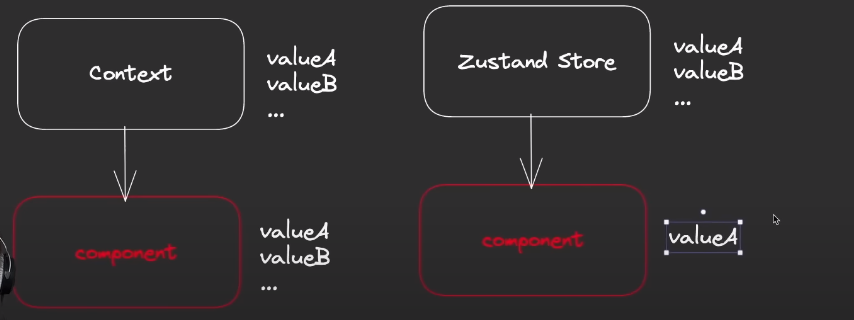
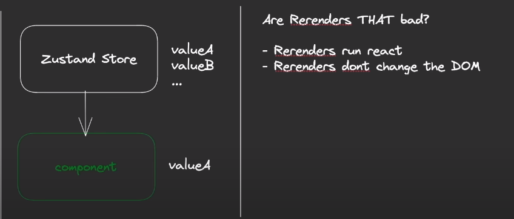

#

<p style="text-align: center; font-size: 20px; font-weight: bold; color: #e68a00"> Why Zustand? </p>

- Well, first of all, Zustand has very little boilerplate, meaning that you don't have to write as much code to get
  started with Zustand as you would with something like Redux, for example, which is really boilerplate heavy.

- Next up, it doesn't rely on a provider. It also means that you don't need to tap into as much React logic and your
  fewer things you can forget, because in something like a module, which can be used in multiple apps that
  would provide their own providers, you might forget you provide in one app and then have issues that
  you could just prevent if you didn't need one.

- It's faster than context. Why is that? Well, it uses a little system that allows you to specifically select what state
  you want to subscribe to.

- It uses state merging by default. That means that if you, for example, have an object {a: 3, b: 4} and you want to
  update only b then you don't need to do {...state, b:7}. Because zustand will do merging for you.

- The next awesome thing about it is that it is extendable by default, meaning that you can use different kinds of
  middleware, some of which are pre-provided to give further functionality to your Tushant app, some of which you can
  even write yourself. So you can hook into the state management process to really make Zushant your own.

- it's little opinionated. So it doesn't rely on a specific way of doing things, meaning you can basically like and
  react, decide how you want to interact with a store. Sure, there's a recommended way, but you don't necessarily need
  to follow it, which again, gives you more options, and of course, some error potential.

- we got our context. And from this context, our component will get state. So like this. And now let's say our component
  has value a and value b, and some other stuff that you can get from it. Well, in the case of context, you might want
  to just get value a, but under the hood, you will always subscribe to all of them. So if you just want value a, for
  example, but where you be changes, then your component will still re-render.

  

  Now let's compare this to Sushnet. With our Sushnet store, we can still have multiple values in our store, but our
  element only subscribes to those that want to subscribe to, meaning that if value b changes, this component doesn't
  re-render. It just stays the way that it is.

  But are re-runners really that bad? Well, no, actually not. Sure, re-renders do run React. So if you have some complex
  React logic, which you should probably have put into a useEffect or useMemo, but anyway, then that will run again on
  every re-render, which is not what you want.

  

  You probably don't need to care as much about it re-rendering too often. And that is because re-runners don't change
  the DOM, at least not necessarily. Because React uses a shadow DOM, meaning that all your changes are created on a
  copy of your DOM, and only if there's a difference between the shadow DOM and the actual DOM, will there actually be a
  command to change the DOM, which is a really expensive part about doing front and stuff, changing the actual DOM. But
  changing the shadow DOM is not nearly expensive, which is why React uses it. So a re-render doesn't hurt your
  application nearly as much if it doesn't change the app.

---

<p style="text-align: center; font-size: 20px; font-weight: bold; color: #e68a00"> Setting up our project </p>

- `npm create vite kanban`, choose JS and then install dependencies

- Run `npm i zustand` to install zustand

- Run `npm run dev` to launch App.

---

<p style="text-align: center; font-size: 20px; font-weight: bold; color: #e68a00"> Creating the basic components </p>

- Added basic components

---

<p style="text-align: center; font-size: 20px; font-weight: bold; color: #e68a00"> Storing tasks </p>

```js
import { create } from "zustand";

const store = (set) => ({
  tasks: [{ title: "TestTask", state: "PLANNED" }],
});

export const useStore = create(store);

const tasks = useStore((store) => store.tasks);
```

---

<p style="text-align: center; font-size: 20px; font-weight: bold; color: #e68a00"> Middleware: Redux toolkit using zustand </p>

```js
import { devtools } from "zustand/middleware";
export const useStore = create(devtools(store));
```

---

<p style="text-align: center; font-size: 20px; font-weight: bold; color: #e68a00"> Middleware: Persist store in local storage </p>

```js
import { devtools, persist } from "zustand/middleware";
export const useStore = create(persist(devtools(store), { name: "store" }));
```

---

<p style="text-align: center; font-size: 20px; font-weight: bold; color: #e68a00"> Middleware: Logger </p>

- Log whenever state changes

  ```js
  const log = (config) => (set, get, api) =>
    config(
      (...args) => {
        console.log(args);
        set(...args);
      },
      get,
      api
    );

  export const useStore = create(
    log(persist(devtools(store), { name: "store" }))
  );
  ```

---

<p style="text-align: center; font-size: 20px; font-weight: bold; color: #e68a00"> Unittest</p>
